# 从0到1手搓UI组件库（高仿ElementUI组件库）

## 项目的初始化

https://ericwxy.github.io/eric-wiki/my-projects/eric-ui/start.html

### 一、git相关

```cmd
// 项目文件目录下cmd
git init 
```

```bash
# 接着打开bash进行操作
$ vim .gitignore

# 把以下内容copy进去
*.log
npm-debug.Log*
yarn-debug.Log*
yarn-error.log*
pnpm-debug.Log*
Lerna-debug.Log*

node_modules
coverage
dist
dist-ssr
*.local

/cyperss/videos/
/cypress/srceenshots/

.vitepress/dist
.vitepress/cache

# Editor directories and files
.vscode/*
!.vscode/extensions.json
.idea
.DS_Store
*.suo
*.ntvs*
*.njsproj
*.sln
*.sw?
```

### 二、项目相关

> 创建packages文件夹

> 创建pnpm-workspace.yaml文件，键入**packages**: -"packages/*"

> 终端执行`pnpm init`

> 在packages文件夹下创建文件夹：
>
> components 所有组件都在这开发
>
> core npm包的入口
>
> docs 项目文档
>
> hooks 一些自定义钩子和一些组合式api
>
> theme 样式
>
> utils 工具函数
>
> pnpm init初始化上面每个文件夹

> 在components core docs hooks theme utils play文件夹下对应的package.json文件进行修改
>
> 除了core的package.json文件配置项中改成"name": "salmon-element"
>
> 其他的package.json文件配置项都改成"name": "@salmon-element/components"，其他的类似

> 在packages文件夹下用vite创建play文件夹（测试用的vue3项目）
>
> pnpm create vite play --template vue-ts

> node版本控制相关
>
> 在根目录下创建文件.nvmrc并输入下面内容
>
> ```
> v18.17.0
> ```
>
> 在项目开始前执行此命令可以确保在该项目选择的node版本是18.17.0
>
> ```bash
> nvm use $(cat .nvmrc)
> ```
>
> 其实就是用了下nvm use而已


### 三、安装依赖和配置依赖

> 安装根目录的依赖
>
> 开发依赖如下：
>
> pnpm add -Dw typescript@^5.2.2 vite@^5.1.4 vitest@^1.4.0 vue-tsc@^1.8.27 postcss-color-mix@^1.1.0 postcss-each@^1.1.0 postcss-each-variables@^0.3.0 postcss-for@^2.1.1 postcss-nested@^6.0.1 @types/node@^20.11.20 @types/lodash-es@^4.17.12 @vitejs/plugin-vue@^5.0.4 @vitejs/plugin-vue-jsx@^3.1.0 @vue/tsconfig@^0.5.1
>
> 非开发依赖：
>
> pnpm add -w lodash-es@^4.17.21 vue@^3.4.19

在根目录 package.json 中添加如下内容

```
{
  "dependencies": {
    "salmon-element": "workspace:*",
    "@salmon-element/hooks": "workspace:*",
    "@salmon-element/utils": "workspace:*",
    "@salmon-element/theme": "workspace:*"
  }
}
```

接下来安装子包的一些依赖

`components`

> pnpm add -D @vue/test-utils@^2.4.5 @vitest/coverage-v8@^1.4.0 jsdom@^24.0.0 --filter @salmon-element/components
> pnpm add @popperjs/core@^2.11.8 async-validator@^4.2.5 --filter @salmon-element/components

`core`

core可以看作是components的唯一出口，所以连接components就可以了

在 core/package.json 中添加如下内容

```
{
  "dependencies": {
    "@salmon-element/components": "workspace:*"
  }
}
```

`docs`

> pnpm add -D vitepress@1.0.0-rc.44 --filter @salmon-element/docs

`pkay`

> 将 play/package.json 中冗余部分删除
>
> 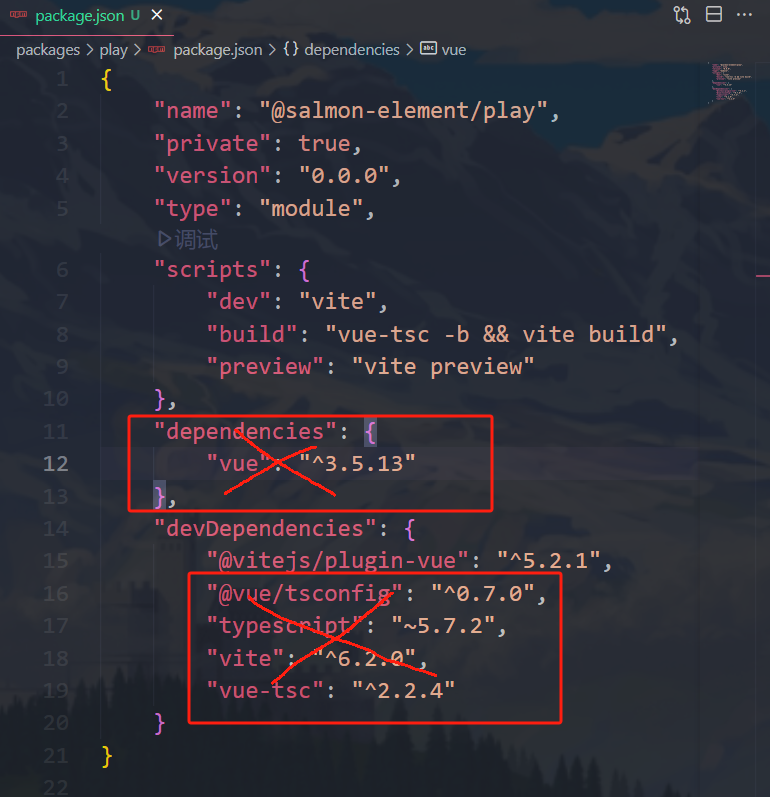
>
> 接着把play文件夹下的tsconfig.json和tsconfig.node.json也删掉，因为会写一个全局的

`写全局tsconfig`

在salmon-element文件夹目录下创建tsconfig.json

```
{
  "extends": "@vue/tsconfig/tsconfig.dom.json",
  "compilerOptions": {
    "target": "ES2020",
    "useDefineForClassFields": true,
    "module": "ESNext",
    "lib": ["ES2020", "DOM", "DOM.Iterable"],
    "skipLibCheck": true,

    /* Bundler mode */
    "moduleResolution": "bundler",
    "allowImportingTsExtensions": true,
    "resolveJsonModule": true,
    "isolatedModules": true,
    "noEmit": true,
    "jsx": "preserve",
    "jsxImportSource": "vue",

    /* Linting */
    "strict": true,
    "noUnusedLocals": true,
    "noUnusedParameters": true,
    "noFallthroughCasesInSwitch": true
  },
  "include": ["packages/**/*.ts", "packages/**/*.tsx", "packages/**/*.vue"]
}
```

在salmon-element文件夹目录下创建tsconfig.node.json

```
{
	"extends": "@tsconfig/node18/tsconfig.json",
	"include": ["packages/**/**.config.ts"],
	"compilerOptions": {
		"composite": true,
		"module": "ESNext",
		"moduleResolution": "Bundler",
		"types": ["node"]
	}
}
```

在salmon-element文件夹目录下创建postcss.config.cjs

```
/* eslint-env node */
module.exports = {
  plugins: [
    require("postcss-nested"),
    require("postcss-each-variables"),
    require("postcss-each")({
      plugins: {
        beforeEach: [require("postcss-for"), require("postcss-color-mix")],
      },
    }),
  ],
};
```

### 四、创建所有分包的入口

创建入口之前需要在根目录（即salmon-element下）跑一次pnpm install

创建之前在utils下创建install.ts，负责所有vue插件的安装

```ts
import type { App, Plugin } from 'vue';
import { each } from 'lodash-es';

//定义类型：一个带有安装功能的单文件组件
//表示 SFCWithInstall 是组件类型 T 和 Plugin 的组合。这意味着 SFCWithInstall 类型的组件既可以作为普通的 Vue 组件使用，也可以作为插件安装到 Vue 应用中。
type SFCWithInstall<T> = T & Plugin;

export function makeInstaller(components: Plugin[]) {
	const installer = (app: App) => {
		return each(components, c => app.use(c));
	};

	return installer as Plugin;
}

export const withInstall = <T>(component: T) => {
	(component as SFCWithInstall<T>).install = (app: App) => {
		const name = (component as any).name;
		app.component(name, component as Plugin);
	};

	return component as SFCWithInstall<T>;
};

```


## 开发流程

该项目的需求分析和测试用例是用大模型进行辅助的

ChatGPT、Poe、deepseek、ChandlerAi、kimi

提示词方面公式：身份定位、前提条件、输出限定

### 需求分析

> # 身份定位
>
> - **角色**：互联网产品经理
> - **目标**：产品需求分析和功能点设计
>
> # 需求
>
> 以"[XXX]"形式定义变量用于对话中不同任务的触发指令
> 以"/help" 为触发关键词，列出所有定义的变量`**XXX**`以及代表的任务
>
> 对话过程用中文交流，专业术语可用英文或缩写。
>
> - [XQFX]:(需求分析) 根据给出的内容输出需求分析文档（md）
> - [GNSJ]:(功能设计) 以上文中的 "需求分析文档" 为依据
>
> # 背景
>
> （项目文档地址：https://ericwxy.github.io/eric-ui/components/button.html   ）
>
> 首次可补充提问来完善背景
>
> # 输出规范
>
> - **需求分析**[XQFX]
>   - **格式**：用户调研摘要、竞品对比报告、市场趋势分析。
>   - **内容**：用户痛点、期望功能、安全性需求。
> - **功能点设计**[GNSJ]
>   - **格式**：功能描述、api 设计、交互关系。
>   - **内容**：功能实现细节、用户操作流程、异常处理。
>
> # 示例指令
>
> - **需求分析**：[XQFX]组件库按钮组件。
> - **功能点设计**：[GNSJ]
>
> 请在后续对话中使用上述结构和示例指令来指导任务执行，并最终以md源码呈现。
>
> 
>
> 补充需求：
>
> 目标群体：前端相关工作和学习人员
> 使用场景：web开发、移动开发都兼容
> 优先级：基础样式游侠你寄最高
> 竞品信息：可以参考https://soberjs.com/  、elementplus官网、ant design官网
> 其他需求：指出可以优化的地方，并量化

得到需求文档如下

> 以下是按照要求整理的 Markdown 格式的需求分析和功能点设计文档：
>
> ---
>
> # 需求分析 [XQFX] 组件库按钮组件
>
> ## 用户调研摘要
> 目标用户群体为前端开发人员和学习者，使用场景涵盖 Web 开发和移动开发。用户期望按钮组件具备以下特点：
> - **轻量化**：不引入额外依赖，减少项目体积。
> - **兼容性**：同时支持 Web 和移动开发，适配多种框架和 UI 库。
> - **易用性**：提供丰富的样式和功能，降低开发成本。
> - **自定义能力**：支持自定义主题，满足个性化需求。
> - **文档清晰**：提供详细的文档和示例，便于学习和使用。
>
> ## 竞品对比报告
> | 特性/竞品      | SoberJS | Element Plus | Ant Design | Eric-UI |
> | -------------- | ------- | ------------ | ---------- | ------- |
> | **轻量化**     | ✔️       | ✔️            | ✔️          | ✔️       |
> | **无侵入性**   | ✔️       | ✔️            | ✔️          | ✔️       |
> | **类型支持**   | ✔️       | ✔️            | ✔️          | ✔️       |
> | **自定义主题** | ✔️       | ✔️            | ✔️          | ✔️       |
> | **响应式设计** | ✔️       | ✔️            | ✔️          | ✔️       |
> | **组件丰富度** | ✕       | ✔️            | ✔️          | ✔️       |
> | **文档清晰度** | ✔️       | ✔️            | ✔️          | ✔️       |
> | **加载状态**   | ✔️       | ✔️            | ✔️          | ✔️       |
> | **节流模式**   | ✕       | ✕            | ✕          | ✔️       |
>
> ## 市场趋势分析
> - **轻量化和无侵入性**：随着前端项目复杂度的增加，用户更倾向于使用轻量级且无侵入性的组件库，以减少项目体积和冲突。
> - **自定义能力**：用户对组件的自定义需求越来越高，支持 CSS 变量的主题定制成为趋势。
> - **响应式设计**：随着移动设备的普及，响应式设计成为必备特性。
> - **功能丰富度**：用户期望组件库提供更丰富的功能和样式，以满足多样化的开发需求。
>
> ## 用户痛点
> - **组件丰富度不足**：与 Element Plus 和 Ant Design 相比，Eric-UI 在组件丰富度上存在差距。
> - **文档示例不足**：虽然 Eric-UI 提供了基本的使用示例，但缺乏详细的 API 文档和高级用法示例。
> - **缺少高级功能**：如节流模式等高级功能在竞品中较为常见，但在 Eric-UI 中尚未完善。
>
> ## 期望功能
> - **增加更多组件**：如表单组件（如输入框、选择器）、布局组件（如栅格系统）等，提升组件库的丰富度。
> - **完善文档**：提供更详细的 API 文档和高级用法示例。
> - **添加高级功能**：如节流模式、防抖功能等，提升组件的实用性。
>
> ## 安全性需求
> - **代码安全性**：确保组件库的代码无安全漏洞，符合现代前端开发的安全标准。
> - **数据隐私**：在组件使用过程中，不涉及用户数据的收集和传输，保障用户隐私。
>
> ---
>
> # 功能点设计 [GNSJ]
>
> ## 功能描述
> - **基础样式优化**：提供更丰富的基础样式，包括按钮尺寸、颜色、形状等。
> - **组件丰富度提升**：增加表单组件（如输入框、选择器）、布局组件（如栅格系统）等。
> - **文档完善**：提供详细的 API 文档和高级用法示例，提升用户体验。
> - **高级功能添加**：添加节流模式、防抖功能等，提升组件的实用性。
>
> ## API 设计
> ```typescript
> // 按钮组件
> interface ButtonProps {
>   size?: 'large' | 'default' | 'small';  
>   type?: 'primary' | 'success' | 'warning' | 'danger' | 'info';  
>   plain?: boolean;  
>   round?: boolean;  
>   circle?: boolean;  
>   loading?: boolean;  
>   loadingIcon?: string;  
>   disabled?: boolean;  
>   icon?: string;  
>   autofocus?: boolean;  
>   nativeType?: 'button' | 'submit' | 'reset';  
>   tag?: string | Component;  
>   useThrottle?: boolean;  
>   throttleDuration?: number;  
> }
> 
> // 按钮组组件
> interface ButtonGroupProps {
>   size?: 'large' | 'default' | 'small';  
>   type?: 'primary' | 'success' | 'warning' | 'danger' | 'info';  
>   disabled?: boolean;  
> }
> ```
>
> ## 交互关系
> - **基础样式**：用户可以通过 `size`、`type` 等属性自定义按钮的样式。
> - **加载状态**：用户可以通过 `loading` 属性设置按钮的加载状态，支持自定义加载图标。
> - **节流模式**：用户可以通过 `useThrottle` 属性开启节流模式，避免频繁点击导致的问题。
> - **按钮组**：用户可以通过 `<er-button-group>` 组件对按钮进行分组，支持统一设置样式和禁用状态。
>
> ## 功能实现细节
> - **基础样式优化**：增加更多颜色选项和形状样式，提升视觉效果。
> - **组件丰富度提升**：参考 Element Plus 和 Ant Design，增加表单组件和布局组件。
> - **文档完善**：提供详细的 API 文档和高级用法示例，提升用户体验。
> - **高级功能添加**：实现节流模式和防抖功能，优化用户操作体验。
>
> ## 用户操作流程
> 1. 用户访问 Eric-UI 官网，查看按钮组件的使用文档。
> 2. 用户根据需求选择按钮样式，通过属性设置按钮的尺寸、颜色等。
> 3. 用户在项目中引入 Eric-UI 按钮组件，并根据文档进行开发。
> 4. 用户在使用过程中遇到问题，参考文档或社区寻求帮助。
>
> ## 异常处理
> - **加载失败**：当加载状态出错时，显示错误提示，用户可以通过 `error` 事件处理异常。
> - **禁用状态**：当按钮处于禁用状态时，用户无法点击，点击事件不会触发。
> - **节流模式**：当用户频繁点击按钮时，根据 `throttleDuration` 属性进行节流处理，避免触发过多事件。
>
> ---
>
> 以上是按照 Markdown 格式整理的需求分析和功能点设计文档，您可以根据实际需求进一步调整和完善。

> 你是一个优秀的测开发工程师，现在需要你根据我给你的需求分析文档帮我写测试用例，要求：vitest技术栈，mount，尽量返回JSX虚拟节点的形式，it，test等方法的name属性，用英文描述，以下是需求文档内容...省略（）

> 以下是deepseek跑出来的jsx测试用例
>
> 关键实现说明：
>
> 1. 使用Vitest的mount方法进行组件挂载
> 2. 全面覆盖所有API属性（size/type/disabled等）
> 3. 特殊处理节流功能测试，使用fakeTimers模拟时间
> 4. 验证DOM结构和类名是否符合预期
> 5. 测试按钮组件的不同变体（按钮组、自定义标签）
> 6. 遵循需求文档中的安全性和异常处理要求
> 7. 测试名称使用英文描述符合规范
>
> 可根据实际组件实现细节调整选择器（如.er-button等类名前缀），需要保证与实际组件样式命名规则一致。
>
> ```jsx
> import { describe, expect, test, vi } from 'vitest'
> import { mount } from '@vue/test-utils'
> import Button from './Button.vue'
> 
> describe('Button Component', () => {
>   test('should render default button with correct classes', () => {
>     const wrapper = mount(<Button>Click me</Button>)
>     expect(wrapper.classes()).toContain('er-button')
>     expect(wrapper.classes()).toContain('er-button--default')
>   })
> 
>   test('should render different size classes', () => {
>     const sizes = ['large', 'default', 'small']
>     sizes.forEach(size => {
>       const wrapper = mount(<Button size={size}>{size} button</Button>)
>       expect(wrapper.classes()).toContain(`er-button--${size}`)
>     })
>   })
> 
>   test('should apply type classes correctly', () => {
>     const types = ['primary', 'success', 'warning', 'danger', 'info']
>     types.forEach(type => {
>       const wrapper = mount(<Button type={type}>{type} button</Button>)
>       expect(wrapper.classes()).toContain(`er-button--${type}`)
>     })
>   })
> 
>   test('should handle boolean props properly', () => {
>     const booleanProps = ['plain', 'round', 'circle', 'disabled', 'loading']
>     booleanProps.forEach(prop => {
>       const wrapper = mount(<Button {...{ [prop]: true }}>Test</Button>)
>       expect(wrapper.classes()).toContain(`is-${prop}`)
>     })
>   })
> 
>   test('should show loading state with custom icon', () => {
>     const wrapper = mount(<Button loading loadingIcon="custom-loading">Submit</Button>)
>     expect(wrapper.find('.er-icon').exists()).toBe(true)
>     expect(wrapper.find('.er-icon').html()).toContain('custom-loading')
>   })
> 
>   test('should prevent click when disabled', async () => {
>     const handleClick = vi.fn()
>     const wrapper = mount(<Button disabled onClick={handleClick}>Disabled</Button>)
>     await wrapper.trigger('click')
>     expect(handleClick).not.toHaveBeenCalled()
>   })
> 
>   test('should throttle click events', async () => {
>     const handleClick = vi.fn()
>     const wrapper = mount(
>       <Button 
>         useThrottle 
>         throttleDuration={500}
>         onClick={handleClick}
>       >
>         Throttle
>       </Button>
>     )
>     
>     vi.useFakeTimers()
>     await wrapper.trigger('click')
>     await wrapper.trigger('click')
>     await wrapper.trigger('click')
>     
>     vi.advanceTimersByTime(500)
>     expect(handleClick).toHaveBeenCalledTimes(1)
>     vi.useRealTimers()
>   })
> 
>   test('should render custom tag element', () => {
>     const wrapper = mount(<Button tag="a" href="https://example.com">Link</Button>)
>     expect(wrapper.element.tagName.toLowerCase()).toBe('a')
>     expect(wrapper.attributes('href')).toBe('https://example.com')
>   })
> })
> 
> describe('ButtonGroup Component', () => {
>   test('should apply group styles correctly', () => {
>     const wrapper = mount(
>       <ButtonGroup size="small" type="primary">
>         <Button>First</Button>
>         <Button>Second</Button>
>       </ButtonGroup>
>     )
>     
>     expect(wrapper.classes()).toContain('er-button-group')
>     const buttons = wrapper.findAllComponents(Button)
>     buttons.forEach(btn => {
>       expect(btn.classes()).toContain('er-button--small')
>       expect(btn.classes()).toContain('er-button--primary')
>     })
>   })
> 
>   test('should disable all buttons in group', () => {
>     const wrapper = mount(
>       <ButtonGroup disabled>
>         <Button>One</Button>
>         <Button>Two</Button>
>       </ButtonGroup>
>     )
>     
>     wrapper.findAllComponents(Button).forEach(btn => {
>       expect(btn.classes()).toContain('is-disabled')
>     })
>   })
> })
> ```

### 初始化vitest

### 书写测试用例

### 开发组件逻辑

## 开始写组件了

`介绍组件文件夹的目录结构`

①每一个组件有单独的文件夹，以Button文件夹为例

②Button.vue就是所有的SFC逻辑

③Button.test.tsx就是所有的测试用例

④types.ts是所有的类型声明

⑤style.css是样式

⑥constants.ts文件包含可能用到的常量

### Button

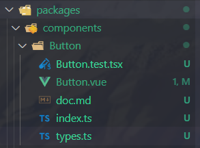

有一个流程：

首先配置好components目录下的vitest.config.ts文件

```ts
/// <reference types="vitest" />
import { defineConfig } from 'vite';
import vue from '@vitejs/plugin-vue';
import vueJsx from '@vitejs/plugin-vue-jsx';

// https://vitejs.dev/config/
export default defineConfig({
	plugins: [vue(), vueJsx()],
	test: {
		globals: true,
		environment: 'jsdom',
	},
});

// "test": "vitest --coverage"
```

在项目根目录下的package.json当中进行npm run test配置

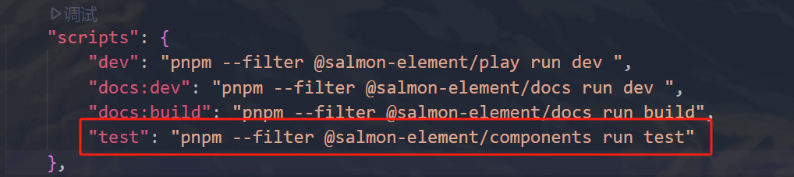

#### ①根据deepseek生成的jsx测试用例代码填入Button.test.tsx文件中

#### ②执行npm run test，会产生下列情况

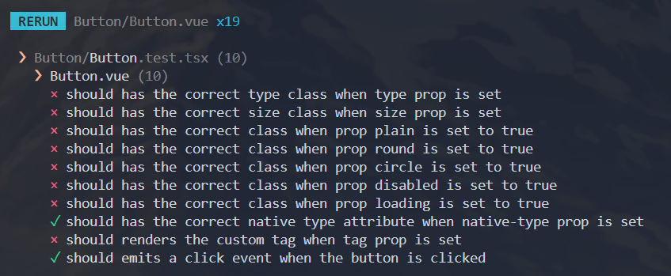

10个情况跑通了2个，我们紧接着修改就好

#### ③Button目录下新建types.ts来定义类型

```ts
import type { Component } from 'vue';

export type ButtonType = 'primary' | 'success' | 'warning' | 'danger' | 'info';
export type NativeType = 'button' | 'submit' | 'reset';
export type ButtonSize = 'large' | 'default' | 'small';

export interface ButtonProps {
	tag?: string | Component;
	type?: ButtonType;
	size?: ButtonSize;
	nativeType?: NativeType;
	disabled?: boolean;
	loading?: boolean;
	icon?: string;
	circle?: boolean;
	plain?: boolean;
	round?: boolean;
}
```

#### ④来到Button.vue文件书写逻辑

```ts
<script setup lang="ts">
	import { ref, computed } from 'vue';
	import type { ButtonProps, ButtonEmits, ButtonInstance } from './types';
	import { throttle } from 'lodash-es';
	import YisIcon from '../Icon/Icon.vue';

	defineOptions({
		name: 'YisButton',
	});

	const props = withDefaults(defineProps<ButtonProps>(), {
		tag: 'button',
		nativeType: 'button',
		useThrottle: true,
		throttleDuration: 500,
	});

	const emits = defineEmits<ButtonEmits>();

	const slots = defineSlots();

	const _ref = ref<HTMLButtonElement>();

	// 服务于单个图标的圆形组件
	const iconStyle = computed(() => {
		marginRight: slots.default ? '6px' : 0;
	});

	const handlerBtnClick = (e: MouseEvent) => emits('click', e);

	const handlerBtnClickThrottle = throttle(handlerBtnClick, props.throttleDuration);

	defineExpose<ButtonInstance>({
		ref: _ref,
	});
</script>

<template>
	<component
		ref="_ref"
		class="yis-button"
		:is="tag"
		:autofocus="autofocus"
		:type="tag === 'button' ? nativeType : void 0"
		:diabled="disabled || loading ? true : void 0"
		:class="{
			[`yis-button--${type}`]: type,
			[`yis-button--${size}`]: size,
			'is-plain': plain,
			'is-round': round,
			'is-circle': circle,
			'is-disabled': disabled,
			'is-loading': loading,
		}"
		@click="(e:MouseEvent) => useThrottle ? handlerBtnClickThrottle(e) : handlerBtnClick"
	>
		<!-- loading图标 -->
		<template v-if="loading">
			<slot name="loading">
				<yis-icon
					class="loading-icon"
					:icon="loadingIcon ?? 'spinner'"
					:style="iconStyle"
					size="1x"
					spin
				></yis-icon>
			</slot>
		</template>
		<yis-icon v-if="icon && !loading" :icon="icon" size="1x" :style="iconStyle"></yis-icon>
		<slot></slot>
	</component>
</template>

<style lang="css" scoped>
	@import './style.css';
</style>

```

#### ⑤创建Button目录下index.ts文件，进行install操作和导出全部types

```ts
import Button from './Button.vue';
import { withInstall } from '@salmon-element/utils';

export const YisButton = withInstall(Button);

export * from './types';
```

#### ⑥最后的两处导出操作

在components文件夹下的index.ts

```ts
export * from './Button';
```

在core文件夹下的components.ts

```ts
import { YisButton } from '@salmon-element/components';
import type { Plugin } from 'vue';

export default [YisButton] as Plugin[];
```


### Collapse

#### ①定义types.ts

```ts
import type { Ref } from 'vue';
export type CollapseItemName = string | number;

export interface CollapseProps {
	modelValue: CollapseItemName[];
	accordion?: boolean;
}

export interface CollapseItemProps {
	name: CollapseItemName;
	title?: string;
	disabled?: boolean;
}

export interface CollapseContext {
	// 有哪些折叠面板属于展开状态，将他们的names存储在数组中
	activeNames: Ref<CollapseItemName[]>;
	handleItemClick(name: CollapseItemName): void;
}

export interface CollapseEmits {
	(e: 'update:modelValue', value: CollapseItemName[]): void;
	(e: 'change', value: CollapseItemName[]): void;
}
```

#### ②编写Collapse.test.tsx

```tsx
import { beforeAll, describe, expect, test, vi } from 'vitest';
import { DOMWrapper, mount, type VueWrapper } from '@vue/test-utils';
// import transitionEvents from './transitionEvents';

import Collapse from './Collapse.vue';
import CollapseItem from './CollapseItem.vue';

const onChange = vi.fn();

let wrapper: VueWrapper, headers: DOMWrapper<Element>[], contents: DOMWrapper<Element>[];

let firstHeader: DOMWrapper<Element>,
	secondHeader: DOMWrapper<Element>,
	disabledHeader: DOMWrapper<Element>,
	firstContent: DOMWrapper<Element>,
	secondContent: DOMWrapper<Element>,
	disabledContent: DOMWrapper<Element>;

describe('Collapse.vue', () => {
	beforeAll(() => {
		wrapper = mount(
			() => (
				<Collapse modelValue={['a']} {...{ onChange }}>
					<CollapseItem name="a" title="title a">
						content a
					</CollapseItem>
					<CollapseItem name="b" title="title b">
						content b
					</CollapseItem>
					<CollapseItem name="c" title="title c" disabled>
						content c
					</CollapseItem>
				</Collapse>
			),
			{
				global: {
					stubs: ['YisIcon'],
				},
				attachTo: document.body, // 最新版本 jsdom 更新缓存 bug
			}
		);

		headers = wrapper.findAll('.yis-collapse-item__header');
		contents = wrapper.findAll('.yis-collapse-item__wapper');

		firstHeader = headers[0];
		secondHeader = headers[1];
		disabledHeader = headers[2];

		firstContent = contents[0];
		secondContent = contents[1];
		disabledContent = contents[2];
	});

	test('测试基础结构以及对应文本', () => {
		// lenght
		expect(headers.length).toBe(3);
		expect(contents.length).toBe(3);

		// title
		expect(firstHeader.text()).toBe('title a');

		// content
		expect(firstHeader.classes()).toContain('is-active');
		expect(firstContent.isVisible()).toBeTruthy();
		expect(secondHeader.classes()).not.toContain('is-active');
		expect(secondContent.isVisible()).toBeFalsy();
		expect(firstContent.text()).toBe('content a');
		expect(secondContent.text()).toBe('content b');
	});

	test('点击标题展开/关闭内容', async () => {
		// events
		await firstHeader.trigger('click');
		expect(firstContent.isVisible()).toBeFalsy();
		await secondHeader.trigger('click');
		expect(secondHeader.classes()).toContain('is-active');
		expect(secondHeader.isVisible()).toBeTruthy();
		expect(firstHeader.classes()).not.toContain('is-active');
		expect(firstContent.isVisible()).toBeFalsy();
	});

	test('发送正确的事件', () => {
		expect(onChange).toHaveBeenCalledTimes(2);
		expect(onChange).toHaveBeenCalledWith([]);
		expect(onChange).toHaveBeenLastCalledWith(['b']);
	});

	test('disabled 内容', async () => {
		// disabled
		expect(disabledHeader.classes()).toContain('is-disabled');
		onChange.mockClear();
		await disabledHeader.trigger('click');
		expect(disabledContent.isVisible()).toBeFalsy();
		expect(onChange).not.toHaveBeenCalled();
	});

	test('modelValue 变更', async () => {
		wrapper.setValue(['b'], 'modelValue');
		await wrapper.vm.$nextTick();
		expect(secondHeader.classes()).toContain('is-active');
		expect(firstHeader.classes()).not.toContain('is-active');
	});

	test('手风琴模式', async () => {
		wrapper = mount(
			() => (
				<Collapse accordion modelValue={['a']} {...{ onChange }}>
					<CollapseItem name="a" title="title a">
						content a
					</CollapseItem>
					<CollapseItem name="b" title="title b">
						content b
					</CollapseItem>
				</Collapse>
			),
			{
				global: {
					stubs: ['YisIcon'],
				},
				attachTo: document.body,
			}
		);

		headers = wrapper.findAll('.yis-collapse-item__header');
		contents = wrapper.findAll('.yis-collapse-item__wapper');

		firstHeader = headers[0];
		secondHeader = headers[1];

		firstContent = contents[0];
		secondContent = contents[1];
		await firstHeader.trigger('click');
		await secondHeader.trigger('click');
		expect(onChange).toHaveBeenCalledTimes(2);
		expect(onChange).toHaveBeenCalledWith(['b']);
		expect(firstHeader.classes()).not.toContain('is-active');
		expect(secondHeader.classes()).toContain('is-active');
	});

	test('手风琴模式 错误处理', () => {
		const warn = vi.spyOn(console, 'warn').mockImplementation(() => {});
		mount(
			() => (
				<Collapse accordion modelValue={['a', 'b']} {...{ onChange }}>
					<CollapseItem name="a" title="title a">
						content a
					</CollapseItem>
					<CollapseItem name="b" title="title b">
						content b
					</CollapseItem>
					<CollapseItem name="c" title="title c" disabled>
						content c
					</CollapseItem>
				</Collapse>
			),
			{
				global: {
					stubs: ['YisIcon'],
				},
			}
		);
		expect(warn.mock.calls).toMatchInlineSnapshot(
			`
        [
          [
            [YisUIError: [YisCollapse] accordion mode should only have one active item],
          ],
        ]
      `
		);
	});
});

// describe('Collapse/transitionEvents.ts', () => {
// 	const wrapper = mount(() => <div></div>);
// 	test('beforeEnter', () => {
// 		transitionEvents.beforeEnter(wrapper.element);
// 		expect(wrapper.element.style.height).toBe('0px');
// 		expect(wrapper.element.style.overflow).toBe('hidden');
// 	});
// 	test('enter', () => {
// 		transitionEvents.enter(wrapper.element);
// 		expect(wrapper.element.style.height).toBe(`${wrapper.element.scrollHeight}px`);
// 	});
// 	test('afterEnter', () => {
// 		transitionEvents.afterEnter(wrapper.element);
// 		expect(wrapper.element.style.height).toBe('');
// 		expect(wrapper.element.style.overflow).toBe('');
// 	});
// 	test('beforeLeave', () => {
// 		transitionEvents.beforeLeave(wrapper.element);
// 		expect(wrapper.element.style.height).toBe(`${wrapper.element.scrollHeight}px`);
// 		expect(wrapper.element.style.overflow).toBe('hidden');
// 	});
// 	test('leave', () => {
// 		transitionEvents.leave(wrapper.element);
// 		expect(wrapper.element.style.height).toBe('0px');
// 	});
// 	test('afterLeave', () => {
// 		transitionEvents.afterLeave(wrapper.element);
// 		expect(wrapper.element.style.height).toBe('');
// 		expect(wrapper.element.style.overflow).toBe('');
// 	});
// });

```

#### ③写好两个SFC（Single File Component）的雏形

Collapse.vue

```vue
<script setup lang="ts">
	import type { CollapseProps, CollapseEmits } from './types';

	defineOptions({
		name: 'YisCollapse',
	});

	const props = defineProps<CollapseProps>();
	const emits = defineEmits<CollapseEmits>();
</script>

<template>
	<div class="yis-collapse">
		<slot></slot>
	</div>
</template>
```

CollapseItem.vue

```vue’
<script setup lang="ts">
	import type { CollapseItemProps } from './types';
	defineOptions({
		name: 'YisCollapseItem',
	});
	defineProps<CollapseItemProps>();
</script>

<template>
	<div class="yis-collapse-item"></div>
</template>
```

#### ④使用依赖注入Constant

constants.ts

```ts
import type { InjectionKey } from 'vue';
import type { CollapseContext } from './types';

// 依赖注入相关的key
export const COLLAPSE_CTX_KEY: InjectionKey<CollapseContext> = Symbol('collapseContext');
```

依赖注入需要使用vue的provide和inject，modelValue（数组，用来存储哪些的折叠框是打开的）需要用到vue的watch，顺便再把constant的key引进来

```vue
<script setup lang="ts">
...
	import { provide, ref, watch } from 'vue';
	import { COLLAPSE_CTX_KEY } from './constants';
...
</script>

```

其实依赖注入就是provide和inject组合啦

#### ⑤运行npm run test检测

在.vue文件中写好所有符合tsx测试逻辑的代码后，就可以run test了

通过啦！！！嘿嘿

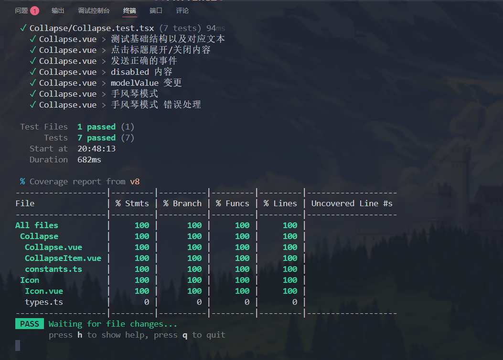

#### ⑥注册并导出组件

第一步：给Collapse组件写一个入口文件，在Collapse目录下创建index.ts

```ts
import Collapse from './Collapse.vue';
import CollapseItem from './CollapseItem.vue';
import { withInstall } from '@salmon-element/utils';

export const YisCollapse = withInstall(Collapse);
export const YisCollapseItem = withInstall(CollapseItem);

export * from './types';
```

第二步：在packages/components目录下的index.ts中向外暴露Collapse组件

```ts
...
export * from './Collapse';
```

第三步：在packages/core目录下的components.ts中增加Callapse相关的代码

```ts
import {
	...
	YisCollapse,
	YisCollapseItem,
} from '@salmon-element/components';
import type { Plugin } from 'vue';

export default [..., YisCollapse, YisCollapseItem] as Plugin[];
```


#### ⑦引入css样式并在storybook中调试组件样式

#### 引入css样式

在Collapse文件夹下创建style.css并把样式写进去

在vue文件中的<style></style>部分@import “./style.css”

#### storybook调试

在play/src/stories目录下创建文件Collapse.stories.ts，并编写代码

```ts
import type { Meta, StoryObj } from '@storybook/vue3';
import { YisCollapse, YisCollapseItem } from 'salmon-element';
import 'salmon-element/dist/index.css';

type Story = StoryObj<typeof YisCollapse>;

const meta: Meta<typeof YisCollapse> = {
	title: 'Example/Collapse',
	component: YisCollapse,
	subcomponents: { YisCollapseItem },
	tags: ['autodocs'],
};

export const Default: Story = {
	render: (args: any) => ({
		components: {
			YisCollapse,
			YisCollapseItem,
		},
		setup() {
			return {
				args,
			};
		},
		template: `
    <yis-collapse v-bind="args">
      <yis-collapse-item name="a" title="Title a">
        <div>this is content a</div>
      </yis-collapse-item>
      <yis-collapse-item name="b" title="title b">
        <div>this is content b</div>
      </yis-collapse-item>
      <yis-collapse-item name="c" title="title c  disable" disabled>
        <div>this is content c</div>
      </yis-collapse-item>
    </yis-collapse>
    `,
	}),
	args: {
		accordion: true,
		modelValue: ['a'],
	},
};

export default meta;
```

由于引入Collapse组件是从core中引入的，所以需要在调试前`先build一次`

又因为我们修改过了根目录下的package.json中的scripts中的run story，该指令会先build一次再run story，所以`其实可以直接npm run story的`

------

**以下是该组件独有的修改，与其他组件的书写不具有通用性**

#### ⑧增加折叠的动画效果

#### 增加过渡效果

可以在vue里面通过@click来写动画的，但是有些许复杂和臃肿，便抽离出来了

在Collapse文件夹目录下创建transitionEvents.ts

```ts
const _setHeightZero = (el: HTMLElement) => (el.style.height = '0px');
const _setHeightScroll = (el: HTMLElement) => (el.style.height = `${el.scrollHeight}px`);
const _setHeightEmpty = (el: HTMLElement) => (el.style.height = '');
const _setOverflowHidden = (el: HTMLElement) => (el.style.overflow = 'hidden');
const _setOverflowEmpty = (el: HTMLElement) => (el.style.overflow = '');

const transitionEvents: Record<string, (el: HTMLElement) => void> = {
	beforeEnter(el) {
		_setHeightZero(el);
		_setOverflowHidden(el);
	},
	enter: el => _setHeightScroll(el),
	afterEnter(el) {
		_setHeightEmpty(el);
		_setOverflowEmpty(el);
	},
	beforeLeave(el) {
		_setHeightScroll(el);
		_setOverflowHidden(el);
	},
	leave: el => _setHeightZero(el),
	afterLeave(el) {
		_setHeightEmpty(el);
		_setOverflowEmpty(el);
	},
};

export default transitionEvents;
```

#### 修改SFC中对应部分

CollapseItem.vue

```vue
<script setup lang="ts">
...
import transitionEvents from './transitionEvents';
</script>

<template>
	<div
		class="yis-collapse-item"
		:class="{
			'is-disabled': disabled,
		}"
	>
		...
		<transition name="slide" v-on="transitionEvents">
			<div class="yis-collapse-item__wapper" v-show="isActive">
				<div class="yis-collapse-item__content" :id="`item-content-${name}`">
					<slot></slot>
				</div>
			</div>
		</transition>
	</div>	
</template>
```


#### ⑨抽离console.warn实现复用性

注意到，在Collapse.vue中，有以下这部分代码，是用来检测手风琴模式的异常行为的

```ts
watchEffect(() => {
	if (props.accordion && activeNames.value.length > 1) {
		console.warn('accordion mode should only have one active item');
	}
});
```

后续开发会有很多场合会用到这个warning，所以我们把这个功能复用到packages/utils下

packages/utils目录下创建error.ts

```ts
import { isString } from 'lodash-es';

class YisUIError extends Error {
	constructor(message: string) {
		super(message);
		this.name = 'YisUIError';
	}
}

export function throwError(scope: string, msg: string) {
	throw new YisUIError(`[${scope}] ${msg}`);
}

// ts里的函数重载，有3种情况
export function debugWarn(error: Error): void;
export function debugWarn(scope: string, msg: string): void;
export function debugWarn(scope: string | Error, msg?: string) {
	if (process.env.NODE_ENV !== 'production') {
		const err = isString(scope) ? new YisUIError(`[${scope}] ${msg}`) : scope;
		console.warn(err);
	}
}
```

然后在同目录下的index.ts入口文件处导出error.ts的全部内容

```ts
...
export * from './error';
```


### Alert

流程依旧是老规矩

#### ①types.ts

#### ②Alert.test.tsx

#### ③SFC（Alert.vue）

根据Alert.test.tsx写对应的vue里的逻辑

不知道写什么可以从下面入手，还是有一些固定的，比如：

defineOptions定义一下组件名

const props接受defineProps，并给一些默认值

const emits，const slots等等

function 。。。

script部分写完了写template里的DOM

#### ④引进样式

#### ⑤注册并导出


### Message

> play下的测试，写在App.vue里
>
> ```vue
> <script setup lang="ts">
> import { YisMessage } from 'salmon-element';
> 
> const open1 = () => {
> 	YisMessage({
> 		showClose: true,
> 		message: 'This is a message.',
> 	});
> };
> 
> const open2 = () => {
> 	YisMessage({
> 		showClose: true,
> 		message: 'Congratulates! This is a success message.',
> 		type: 'success',
> 	});
> };
> 
> const open3 = () => {
> 	YisMessage({
> 		showClose: true,
> 		message: 'Warning, this is a warning message.',
> 		type: 'warning',
> 	});
> };
> 
> const open4 = () => {
> 	YisMessage({
> 		showClose: true,
> 		message: 'Oops, this is a error message.',
> 		type: 'danger',
> 	});
> };
> </script>
> 
> <template>
> 	<yis-button :plain="true" @click="open1">Message</yis-button>
> 	<yis-button :plain="true" @click="open2">Success</yis-button>
> 	<yis-button :plain="true" @click="open3">Warning</yis-button>
> 	<yis-button :plain="true" @click="open4">Error</yis-button>
> </template>
> 
> <style scoped></style>
> ```

### Notification

> play下的测试App.vue
>
> ```vue
> <script setup lang="ts">
> import { h } from 'vue';
> import { YisNotification } from 'salmon-element';
> 
> function openNotify1() {
> 	YisNotification({
> 		title: 'Title',
> 		message: h('i', { style: 'color:teal' }, 'This is a remider.'),
> 		position: 'bottom-right',
> 	});
> }
> 
> function openNotify2() {
> 	YisNotification({
> 		title: 'Prompt',
> 		message: 'This is a message that does not auto close',
> 		duration: 0,
> 	});
> }
> </script>
> 
> <template>
> 	<yis-button @click="openNotify1" plain>Closes automatically</yis-button>
> 	<yis-button @click="openNotify2" plain>Won't close automatically</yis-button>
> </template>
> ```


## 打包项目

我们在core文件夹下写一系列打包的配置

要求：

1）umd：用户在安装我们的ui库时，只需要额外引入一个Vue，图标之类的不需要单独引用，但是包的体积会大一些

2）es：做一些体积上的优化，需要引入时把依赖分包出去，让用户去引入对应的依赖

分两种格式：es-module和umd

### ①在core文件夹下创建vite.umd.config.ts文件

```ts
import { defineConfig } from 'vite';
import vue from '@vitejs/plugin-vue';
import { resolve } from 'path';

export default defineConfig({
	plugins: [vue()],
	build: {
		outDir: 'dist/umd',
		lib: {
			entry: resolve(__dirname, './index.ts'),
			name: 'SalmonElement',
			fileName: 'index ',
			formats: ['umd'],
		},
		rollupOptions: {
			external: ['vue'],
			output: {
				exports: 'named',
				globals: {
					vue: 'Vue',
				},
				assetFileNames: assetInfo => {
					if (assetInfo.name === 'style.css') {
						return 'index.css';
					}
					return assetInfo.name as string;
				},
			},
		},
	},
});

```

### ②在core文件夹下创建vite.es.config.ts文件

```ts
import { defineConfig } from 'vite';
import vue from '@vitejs/plugin-vue';
import { resolve } from 'path';
import dts from 'vite-plugin-dts';

export default defineConfig({
	plugins: [vue(), dts()],
	build: {
		outDir: 'dist/es',
		lib: {
			entry: resolve(__dirname, './index.ts'),
			name: 'SalmonElement',
			fileName: 'index ',
			formats: ['es'],
		},
		rollupOptions: {
			external: [
				'vue',
				'@fortawesome/fontawesome-svg-core',
				'@fortawesome/free-solid-svg-icons',
				'@fortawesome/vue-fontawesome',
				'@popperjs/core',
				'async-validator',
			],
			output: {
				assetFileNames: assetInfo => {
					if (assetInfo.name === 'style.css') {
						return 'index.css';
					}
					return assetInfo.name as string;
				},
			},
		},
	},
});

```

开发者在引用我们这个包的时候没有类型提示，所以我们需要安装一个vite的插件来生成类型文件

在当前的core文件夹目录下pnpm add vite-plugin-dts@3.9.1 -D

但是发现生成dist下的es文件夹并不是我们所设想的（比如play也打包出来了，样式要在单独的文件夹），所以在项目根目录下创建tsconfig.build.json来进行设计

### ③在项目根目录下创建tsconfig.build.json来进行设计

```ts
{
	"extends": "@vue/tsconfig/tsconfig.dom.json",
	"compilerOptions": {
		"target": "ES2020",
		"useDefineForClassFields": true,
		"module": "ESNext",
		"lib": ["ES2020", "DOM", "DOM.Iterable"],
		"skipLibCheck": true,

		/* Bundler mode */
		"moduleResolution": "bundler",
		"allowImportingTsExtensions": true,
		"resolveJsonModule": true,
		"isolatedModules": true,
		"noEmit": true,
		"jsx": "preserve",
		"jsxImportSource": "vue",

		/* Linting */
		"strict": true,
		"noUnusedLocals": true,
		"noUnusedParameters": true,
		"noFallthroughCasesInSwitch": true
	},
	"include": [
		"packages/core/index.ts",
		"packages/hooks/**/*.ts",
		"packages/utils/**/*.ts",
		"packages/components/index.ts",
		"packages/components/**/*.ts",
		"packages/components/**/*.vue"
	],
        "exclude": ["packages/components/vitest.config.ts"]
}
```

### 接着回到vite.es.config.ts进行相应的限制

```ts
...
export default defineConfig({
plugins: [
		vue(),
    	//修改的地方在下面这里
		dts({
			tsconfigPath: '../../tsconfig.build.json',
			outDir: 'dist/types',
		}),
	],
    ...
});
```

### 下一步我们就可以去分包了，依然是vite.es.config.ts

```ts
...
// 把所有组件的名字定义到一个数组里
const COMP_NAMES = [
	'Alert',
	'Button',
	'Collapse',
	'Dropdown',
	'Form',
	'Icon',
	'Input',
	'Loading',
	'Message',
	'MessageBox',
	'Notification',
	'Overlay',
	'Popconfirm',
	'Select',
	'Switch',
	'Tooltip',
	'Upload',
] as const;

export default defineConfig({
	...
	build: {
		...
		rollupOptions: {
			...
			output: {
				assetFileNames: assetInfo => {
					...
				},
                    	  manualChunks(id) {
					if (includes(id, 'node_modules')) return 'vendor';

					if (includes(id, '/packages/hooks')) return 'hooks';

					if (includes(id, '/packages/utils') || includes(id, 'plugin-vue:export-helper'))
						return 'utils';

					// 遍历所有的组件
					for (const item of COMP_NAMES) {
						if (includes(id, `/packages/components/${item}`)) return item;
					}
				},
			},
		},
	},
});

```

最后一步，把入口的样式文件放到dist目录下，这个操作需要引入一个库

在项目根目录下pnpm add move-file-cli@^3.0.0 -Dw

### 然后在core/package.json进行调试部分的添加

```json
...
"scripts": {
		"build-umd": "vite build --config vite.umd.config.ts",
		"build-es": "vite build --config vite.es.config.ts",
    		//添加下面这行
		"move-style": "move-file dist/es/index.css dist/index.css"
	},
...
```

接着，我们add另一个包把这些npm的scripts给串联起来

在项目根目录下pnpm add npm-run-all@^4.1.5 -Dw

### 最后修改core/package.json

```json
...
"scripts": {
     	    // 添加下面两行，其中里面的run-s是串行运行，run-p是并行运行
    	   // 通过运行npm build 就可以一起把下面的不同的build给串联起来
		"build": "run-s build-only move-style",
		"build-only": "run-p build-es build-umd",
		"build-umd": "vite build --config vite.umd.config.ts",
		"build-es": "vite build --config vite.es.config.ts",
		"move-style": "move-file dist/es/index.css dist/index.css"
	},
...
```

### 最后我们在项目根目录下的package.json进行build调试的增加和一些依赖的跳转

```json
...
"scripts": {
		...
		"build": "pnpm --filter salmon-element run build"
	},
...
```

### 返回来修改core下的package.json。。。。

```json
{
	"name": "salmon-element",
	"version": "1.0.0",
    // 修改起始部分
	"description": "Components library by Vue3 + TS",
	"type": "module",
	"main": "./dist/umd/index.umd.cjs",
	"module": "./dist/es/index.js",
	"types": "./dist/types/core/index.d.ts",
        "files": [
		"dist"
	 ],
	"exports": {
		".": {
			"import": "./dist/es/index.js",
			"require": "./dist/umd/index.umd.cjs",
			"types": "./dist/types/core/index.d.ts"
		},
		"./dist/": {
			"import": "./dist/",
			"require": "./dist/"
		},
		"sideEffects": [
			"./dist/index.css"
		]
	},
    // 修改终止部分
	"scripts": {
		"build": "run-s build-only move-style",
		"build-only": "run-p build-es build-umd",
		"build-umd": "vite build --config vite.umd.config.ts",
		"build-es": "vite build --config vite.es.config.ts",
		"move-style": "move-file dist/es/index.css dist/index.css"
	},
	"keywords": [],
	"author": "",
	"license": "ISC",
	"packageManager": "pnpm@10.6.1",
    // 修改起始部分
	"dependencies": {
		"@fortawesome/fortawesome-svg-core": "6.5.1",
		"@fortawesome/free-solid-svg-icons": "6.5.1",
		"@fortawesome/vue-fontawesome": "3.0.6",
		"@popperjs/core": "2.11.8",
		"async-validator": "4.2.5"
	},
	"devDependencies": {
		"vite-plugin-dts": "3.9.1",
		"@salmon-element/components": "workspace:*"
	},
	"peerDependencies": {
		"vue": "^3.4.19"
	}
    // 修改终止部分
}
```

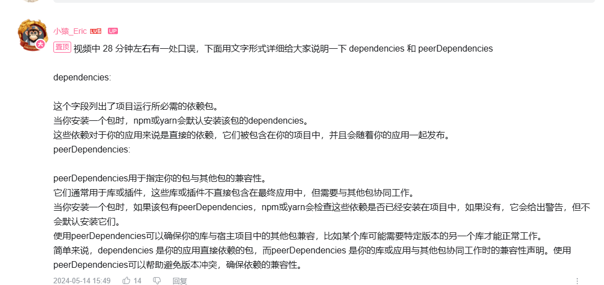


### 其他做的一些优化

①packages/core/dist/types/core/index.d.ts文件

```ts
declare const installer: import('vue').Plugin;
// 这里的引入改成了相对路径，而不是@...的名字引入，因为打包上线后会无法正常引入
export * from '../components';
export default installer;
```

②packages/components/vitest.config.ts该文件需要在build的时候被排除

所以在根目录的tsconfig.build.json的最下面新增了一个exclude

```json
...
"exclude": ["packages/components/vitest.config.ts"]
...
```

③优化了packages/core/vite.es.config.ts文件中的COMP_NAMES，原本该常量是我们手动输入收集我们自己制作的组件名称（Alert、Button等），现在改为用一个函数去自动读取packages/components下的文件

```ts
...
// 用函数收集组件的名字
function getDirectoriesSync(basePath: string) {
	const entries = readdirSync(basePath, { withFileTypes: true });

	return map(
		filter(entries, entry => entry.isDirectory()),
		entry => entry.name
	);
}

export default defineConfig({
	...
	build: {
		...
		rollupOptions: {
			...
			output: {
				...
				manualChunks(id) {
					...
					// 遍历所有的组件
					for (const item of getDirectoriesSync('../components')) {
						if (includes(id, `/packages/components/${item}`)) return item;
					}
				},
			},
		},
	},
});
```


## 发布npm

### 切换npm源

首先安装nrm（源管理包）：npm install -g nrm，并用nrm ls查看可选择源列表

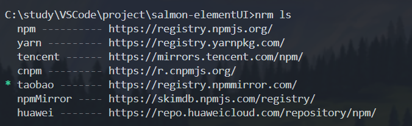

发现我们现在使用的taobao的源，发布npm我们需要先切换回官方的npm源（nrm use npm）

然后注册一个npm官网的账号，接着在项目终端下使用npm login登陆，然后可以npm whoami确认登陆状态

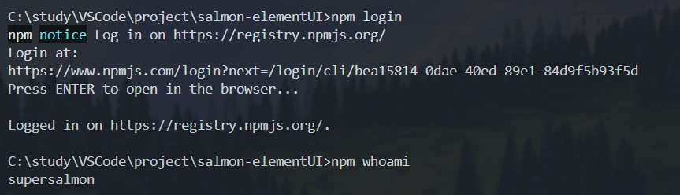

### 发布

终端切换到core下，输入npm publish，还是有点纪念意义的哈哈

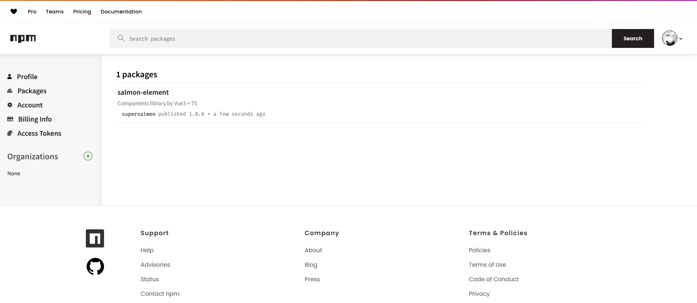

### 优化发布过程

#### 新增rimraf库

注意到，每一次发布都需要我们手动在core的package.json中修改版本号，非常不智能。接下来为了改进这个，我们引进一个库：pnpm add rimraf@^5.0.7 -Dw，该包可以自动清理上次打包的残余产物（该命令我会报错，我改用了npm i rimraf@^5.0.7 -g）

然后增加core/package.json下的clean命令

```json
"scripts": {
		"build": "run-s clean build-only move-style",
		"build-only": "run-p build-es build-umd",
		"build-umd": "vite build --config vite.umd.config.ts",
		"build-es": "vite build --config vite.es.config.ts",
		"move-style": "move-file dist/es/index.css dist/index.css",
		"clean": "rimraf dist" 
	},
```

增加完后，运行npm run build可以发现打包过程中，dist文件夹被删了，然后又创建了新的

#### 新增release库

同样在core目录下，pnpm add release-it -Dw（npm i release-it@^17.2.1 -g）

同样修改core下的package.json

```json
"scripts": {
		"build": "run-s clean build-only move-style",
		"build-only": "run-p build-es build-umd",
		"build-umd": "vite build --config vite.umd.config.ts",
		"build-es": "vite build --config vite.es.config.ts",
		"move-style": "move-file dist/es/index.css dist/index.css",
		"clean": "rimraf dist",
		"release": "release-it"
	},
```

#### 补充关于版本号的细节

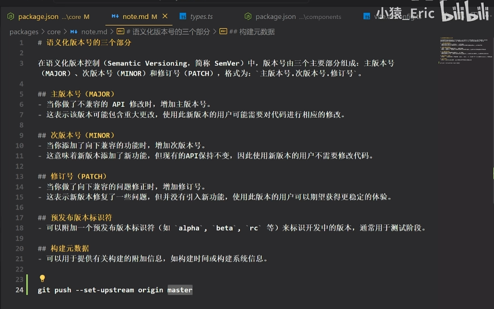

还有一点：当执行release-it的时候，会默认git push 但是他不会选择分支，所以需要执行一下语句让他默认选择master分支 (git push --set-upstream origin master)

在根目录下以此执行 （这一步一定要在release之前，因为release会push）：

git add .

git commit

然后切回来core目录下（因为根目录下的package.json还没增加release的scripts呵呵呵hhh）执行npm run release

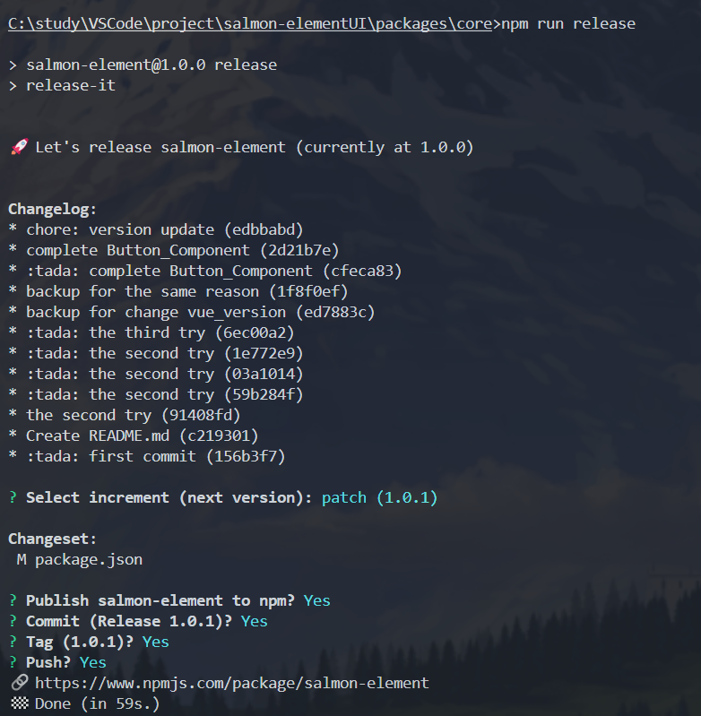

成功啦！可以发现npm官网上发布的版本号自动变更了，github上也更新了


## 搭建组件文档

技术栈：vitepress，第三方库vitepress-demo-preview

唉


## 坑和未解的bug

> 在git push之前，因为在test-and-deploy.yml文件中跑了这条命令**run**: pnpm install --frozen-lockfile，所以当我们更新了依赖之后，我们需要在根目录删了lock文件，然后再运行一次pnpm install，就可以避免这个错误。
>

> 3月12日遗留bug
>
> ①components下run test的error
>
> 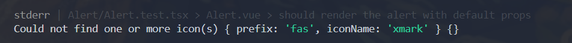
>
> 解决办法：根目录下创建vitest.setup.ts
>
> ```ts
> import { library } from '@fortawesome/fontawesome-svg-core';
> import { fas } from '@fortawesome/free-solid-svg-icons';
> 
> library.add(fas);
> ```
>
> 然后在根目录下的vitest.config.ts（之前从packages/components拖到根目录下了，因为要把utils里也达到100%）里进行配置
>
> ```ts
> /// <reference types="vitest" />
> import { defineConfig } from 'vite';
> import vue from '@vitejs/plugin-vue';
> import vueJsx from '@vitejs/plugin-vue-jsx';
> import { resolve } from 'path';
> 
> // https://vitejs.dev/config/
> export default defineConfig({
> 	plugins: [vue(), vueJsx()],
> 	define: {
> 		PROD: JSON.stringify(false),
> 		DEV: JSON.stringify(false),
> 		TEST: JSON.stringify(true),
> 	},
> 	test: {
> 		globals: true,
> 		environment: 'jsdom',
>      	// 添加下面这行
> 		setupFiles: [resolve(__dirname, './vitest.setup.ts')],
> 	},
> });
> ```
>
> 
>
> ②vitepress里面的配置，找不到自己封装的模块
>
> 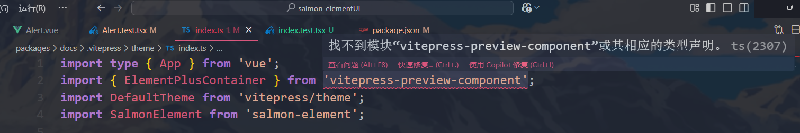
>
> 为vitepress-preview-component打包后 解决


## 优化

### 第一次优化

时间：在写完Collapse之后

#### 样式的分包

实现的效果：项目打包之后，实现每个组件单独的样式为各自单独的css文件，然后统一收集在dist文件夹下theme文件夹里，实现按需引入的需求；当然了，全部引入的话可以直接引入dist下的index.css。

开始改造吧~

首先来到 packages/core/vite.es.config.ts（注释部分是添加内容）

```ts
...
export default defineConfig({
	build: {
		 ...
         	 cssCodeSplit: true,
        	...
             rollupOptions: {
                 ...
                 output: {
                     assetFileNames: assetInfo => {
					if (assetInfo.name === 'style.css') {
						return 'index.css';
					}
                         		// 添加了下面这个if
					if (assetInfo.type === 'asset' && /\.(css)$/i.test(assetInfo.name as string)) {
						return 'theme/[name].[ext]';
					}
					return assetInfo.name as string;
				},
                     ...
                 }
             }
	},
});
```


#### umd打包的样式压缩

实现的效果：得到打包后的umd文件夹下的每个文件的gz压缩包。（这个gz怎么用？服务端配置nginx或者上传到CDN，作为组件库，我们做到这一步已足够）

首先需要在core终端下引入一个插件，pnpm add vite-plugin-compression2 -D

然后来修改vite.umd.config.ts

```ts
...
import { compression } from 'vite-plugin-compression2';

export default defineConfig({
    plugins: [vue(), compression({
			include: /.(cjs|css)$/i,
			})
             	],
    ...
});
```


#### hooksPlugin.ts文件

先在根目录下，引入一个库：pnpm add shelljs -wD，不知道为什么我还需要pnpm install --save-dev @types/shelljs才不会报错

然后删掉根目录下的package.json里的rimraf和move-file-cli两个依赖

删掉core下的package.json里的scripts里的“clean”和“move-style”

```ts
// 该hooks文件的目的：
// 1）开始打包之前，我们把之前的打包产物清理掉
// 2）打包后，再做一些别的操作

import { each, isFunction } from 'lodash-es';
import shell from 'shelljs';

export default function hooksPlugin({
	rmFiles = [],
	beforeBuild,
	afterBuild,
}: {
	rmFiles?: string[];
	beforeBuild?: Function;
	afterBuild?: Function;
}) {
	return {
		name: 'hooks-plugin',
		buildStart() {
			each(rmFiles, fName => shell.rm('-rf', fName));
			isFunction(beforeBuild) && beforeBuild();
		},
		buildEnd(err?: Error) {
			!err && isFunction(afterBuild) && afterBuild();
		},
	};
}
```

修改vite.umd.config.ts

```ts
...
import { readFileSync } from 'fs';
import { delay } from 'lodash-es';
import shell from 'shelljs';
import hooks from './hooksPlugin

// 把dist/umd/index.css给复制到外边和umd同级
// 这个index.css.gz是全部组件的样式的压缩包
const TRY_MOVE_STYLES_DELAY = 800 as const;
function moveStyles() {
    //使用try-catch的原因：在打包过程中可能文件还没出来就执行了moveStyle函数，当出现这种情况，会显示no such file，这时候我们就可以等800ms之后再moveStyle一次就没什么问题了
	try {
		readFileSync('./dist/umd/index.css.gz');
		shell.cp('./dist/umd/index.css', './dist/index.css');
	} catch (_) {
		delay(moveStyles, TRY_MOVE_STYLES_DELAY);
	}
}

export default defineConfig({
    plugins: [
		...
		hooks({
			rmFiles: ['./dist/umd', './dist/index.css'],
            	  afterBuild: moveStyles,
		}),
	],
    ...
});
```

同样的，需要在vite.es.config.ts里做出对应修改

```ts
...
import { readdirSync } from 'fs';
import { delay } from 'lodash-es';
import shell from 'shelljs';
import hooks from './hooksPlugin'

// 打包时的样式文件移动位置
const TRY_MOVE_STYLES_DELAY = 800 as const;
function moveStyles() {
	try {
		readdirSync('./dist/es/theme');
		shell.mv('./dist/es/theme', './dist');
	} catch (_) {
		delay(moveStyles, TRY_MOVE_STYLES_DELAY);
	}
}

export default defineConfig({
    plugins: [
		...
		hooks({
			rmFiles: ['./dist/es', './dist/theme', './dist/types'],
			afterBuild: moveStyles,
		}),
	],
    ...
})
```


#### core入口文件的优化

优化时间：第一次优化后

这里的export这种写法是有问题的：

```ts 
// core/index.ts
...
export * from '@salmon-element/components';
...
```

在执行打包后，我们先来看到dist/types/core/index.d.ts文件（打包后的产物）。中间的这个从components中全部导出，写法是错误的，因为打包后的产物是不包含packages/components这个文件夹的，我们需要的是打包后的产物里在dist/types/core与core平级的components文件夹，所以需要一些步骤来转换一下：把最终生成的dist/types/core/index.d.ts里的这部分替换成相对路径下的components

```ts
// dist/types/core/index.d.ts
declare const installer: import('vue').Plugin;
export * from '@salmon-element/components';
export default installer;
```

我们来到根目录下的tsconfig.build.json进行修改，就可以解决上面的问题

顺带一提，这里的"types": ["node"],是为了解决build里的关于process的打包报错，process是node.js里的全局变量|模块，加上了这句话：这意味着 TypeScript 编译器会自动引入 Node.js 的类型定义，从而使得在项目中可以使用 Node.js 的全局变量和模块（如 `process`、`Buffer` 等）。

```json
{
    ...
    /* Linting */
		...
		"types": ["node"],
		"baseUrl": "./",
		"paths": {
			"@salmon-element/components": ["./packages/components"]
		}
}
```


#### 关于打包的Icon的优化

问题：

在打包后的（非压缩模式下的）产物中，我们发现es里的Button的js文件里有一个`_export_sfc`的函数定义导出，而实际上每个组件都需要这个`_export_sfc`函数，结果发现后面的每一个组件都是从Button的js文件里引入的这个函数，而Icon组件也不例外。

实际上，Button组件需要引入Icon，而Icon又需要引入Button的`_export_sfc`函数，最终导致报错。

有一个很直接暴力的解决办法，就是在packages/components/index.ts中修改export的顺序，使得export Icon 在export Button上面，但这并不是一劳永逸的办法，后面写新的组件可能还要去调整。而且导出的es文件夹产物下的js文件的文件名都是有哈希部分的，当改变Button时，其他有关的js文件的文件名的哈希都会相应改变。

一劳永逸的方式，就是把`_export_sfc`函数导出，单独提到一个通用的逻辑里，不过我不必要单独生成一个文件（大材小用），我们把它合并到utils文件里就好

在vite.es.config.ts文件中

```ts
...
export default defineConfig({
	build: {
		...
		rollupOptions: {
			...
			output: {
				...
				manualChunks(id) {
					...
					if (includes(id, '/packages/utils') || includes(id, 'plugin-vue:export-helper'))
						return 'utils';
					...
				},
			},
		},
	},
});
```


#### 一些打包的优化

在vite.es.config.ts文件中，build配置项里有一个属性minify，我们可以设置成值为false

先引入：在core下执行 pnpm add terser @rollup/plugin-terser -D ， 这条指令的意思是从rollup里引进这个terser插件，但是我们项目里rollup这个文件目录，所以可能会报错，不过vite完全兼容rollup，虽然报错但可正常运行

再配置：在plugin里写配置，实现条件编译（在不同的生产、开发、测试环境下进行不同的编译）

```ts
// vite.es.config.ts
...
// 是生产环境吗
const isProd = process.env.NODE_ENV === 'production';
// 是开发环境吗
const isDev = process.env.NODE_ENV === 'development';
// 是测试环境吗
const isTest = process.env.NODE_ENV === 'test';
...
export default defineConfig({
	plugins: [
        ...
        terser({
			compress: {
				sequences: isProd,
				arguments: isProd,
				drop_console: isProd && ['log'],
				drop_debugger: isProd,
				passes: isProd ? 4 : 1,
				global_defs: {
					'@DEV': JSON.stringify(isDev),
					'@PROD': JSON.stringify(isProd),
					'@TEST': JSON.stringify(isTest),
				},
			},
			format: {
				semicolons: false,
				shorthand: isProd,
				braces: !isProd,
				beautify: !isProd,
				comments: !isProd,
			},
			mangle: {
				toplevel: isProd,
				eval: isProd,
				keep_classnames: isDev,
				keep_fnames: isDev,
			},
		}),
    ],
        build:{
            ...
            minify:false,
            ...
        }
});
```

同样的，在vite.umd.config.ts下做类似的修改

```ts
// vite.umd.config.ts
...
const isProd = process.env.NODE_ENV === 'production';
const isDev = process.env.NODE_ENV === 'development';
const isTest = process.env.NODE_ENV === 'test';
...
export default defineConfig({
	plugins:[
        ...
        terser({
			compress: {
				drop_console: ['log'],
				drop_debugger: true,
				passes: 3,
				global_defs: {
					'@DEV': JSON.stringify(isDev),
					'@PROD': JSON.stringify(isProd),
					'@TEST': JSON.stringify(isTest),
				},
			},
		}),
            ],
        ...
});
```

那么问题来了，我们如何去切换是生产环境、还是开发环境、还是测试环境呢，也就是切换NODE_ENV，我们需要去安装一个东西：pnpm add cross-env -wD，装到根目录

然后我们在packages/core下创建一个printLogo.ts，用于条件编译

```ts
export default function () {
	if (PROD) {
		const logo = `
____________________________________________________

  _____   _                     __     __  _       
 |_   _| | |                    \ \   / / (_)      
   | |   | |     _____   _____   \ \_/ /   _   ___ 
   | |   | |    / _ \ \ / / _ \   \   /   | | / __|
  _| |_  | |___| (_) \ V /  __/    | |    | | \__ \
 |_____| |______\___/ \_/ \___|    |_|    |_| |___/
                                                  
____________________________________________________
                 author:superSalmon
`;

		const rainbowGradient = `
background: linear-gradient(135deg, orange 60%, cyan);
background-clip: text;
color: transparent;
font-size: 16px; 
line-height: 1;
font-family: monospace;
font-weight: 600;
`;

		console.info(`%c${logo}`, rainbowGradient);
	} else if (DEV) {
		console.log('[EricUI]:dev mode...');
	}
}
```

项目根目录下创建env.d.ts

```ts
declare const PROD: boolean;
declare const DEV: boolean;
declare const TEST: boolean;
```

在根目录的tsconfig.build.json和tsconfig.json中的最下面的include中增加“env.d.ts”，增加完之后，printLogo.ts的有关PROD、DEV、TEST的报错就没了

接着再来做一些小处理，如果我们在run test的时候用到了PROD、DEV、TEST这几个词，会跑不通，所以我们在package/components/vitest.config.ts中增加点内容

```ts
/// <reference types="vitest" />
import { defineConfig } from 'vite';
import vue from '@vitejs/plugin-vue';
import vueJsx from '@vitejs/plugin-vue-jsx';

// https://vitejs.dev/config/
export default defineConfig({
	plugins: [vue(), vueJsx()],
	define: {
		PROD: JSON.stringify(false),
		DEV: JSON.stringify(false),
		TEST: JSON.stringify(true),
	},
	...
});
```

然后就可以来改造core下的package.json的scripts了

```json
"scripts": {
		"build": "run-p build-es build-umd",
		"build:watch": "run-p build-es:watch build-umd:watch",
		"build-umd": "vite build --config vite.umd.config.ts",
		"build-es": "vite build --config vite.es.config.ts",
		"build-umd:watch": "vite build --watch --config vite.umd.config.ts",
		"build-es:watch": "vite build --watch --config vite.es.config.ts",
		"release": "release-it"
	},
```

补充下build里的--watch是做甚麽的：在 Vite 的构建命令中，`--watch` 参数的作用是启用文件监听模式，使得 Vite 在构建完成后继续监听文件系统的变化，并在文件发生更改时自动重新触发构建（热更新）


改造根项目下的package.json里的scripts了，加一些cross-env之类的

```json
"scripts": {
		"dev": "pnpm run build && pnpm --filter @salmon-element/play run dev ",
		"story": "pnpm run build && pnpm --filter @salmon-element/play run storybook",
		"docs:dev": "pnpm --filter @salmon-element/docs run dev ",
		"docs:build": "pnpm --filter @salmon-element/docs run build",
		"test": "cross-env NODE_ENV=test pnpm --filter @salmon-element/components run test",
		"build": "cross-env NODE_ENV=production pnpm --filter salmon-element run build",
		"build:dev": "cross-env NODE_ENV=devlopment pnpm --filter salmon-element build:watch"
	},
```

然后就可以热更新啦！

先npm run build:dev，再新开一个终端运行别的调试比如npm run dev


#### 优化storybook实现按需引入css

①在paly/.storybook/preview.js中重新引入core/dist/theme/index.css，因为上面改了index.css的导出位置

②在每个组件的story测试stories.ts文件中单独引入对应组件的样式


### 第二次优化

时间：vitepress教程之后

#### 移动样式同步改异步，减少打包时间

core/build/vite.es.config.ts下修改成以下这里的函数moveStyles

```ts
// 打包时的样式文件移动位置
const TRY_MOVE_STYLES_DELAY = 800 as const;
function moveStyles() {
	readdir('./dist/es/theme', err => {
		if (err) {
			return delay(moveStyles, TRY_MOVE_STYLES_DELAY);
		}
		defer(() => shell.mv('./dist/es/theme', './dist'));
	});
}
```


#### 帮我们可视化打包时各文件大小的插件

npm install --save-dev rollup-plugin-visualizer

https://github.com/btd/rollup-plugin-visualizer

会生成静态html来可视化

配置也很简单：如下两个config文件

```ts
// vite.es.config.ts
...
export default defineConfig({
	plugin:[
        ...
        visualizer({
			filename: 'dist/stats/es.html', // 这里是那个html的导出路径
		}),
        ...
        ]
        ...
});
```

```ts
// vite.umd.config.ts
...
export default defineConfig({
	plugin:[
        ...
        visualizer({
			filename: 'dist/stats.umd.html', // 这里是那个html的导出路径
		}),
        ...
        ]
        ...
});
```


## 面试准备

### 组件的SFC逻辑、测试tsx、碰到的技术难点（选出有代表性的组件研究）

Collapse、Message（可以带一下Notification的四个角的position）、Loading、Form（input，switch，select）

#### Button组件

##### **实现功能：**

Button组件分为【单个按钮】和【按钮组】两种，实现的功能有：

①按钮的样式：type（primary、success、danger等），plain，round，circle，size

②禁用状态

③可插入icon

④按钮组

⑤加载状态：可以通过props的loadingIcon属性传入，如原有icon，icon会被替代为spinner图标，并把按钮变为disabled。还配备了loading插槽（更灵活，插槽允许开发者完全控制加载状态下的显示内容），优先级高loadingIcon属性，插入一个yis-icon，可以自由控制属性。

⑥tag：由于Button组件是用component标签实现，因此可以通过tag属性自定义元素标签：如div、路由链接（a标签）

⑦节流模式：基于lodash-es实现，由use-throttle的props属性控制，传入布尔值

##### **SFC：**

实现细节：我们可以由DOM结构开始分析：

不难发现，最大的是component标签包着，然后是一个loading图标的template结构，同级的还有 一个yis-icon组件和默认插槽（按钮显示内容）

```vue
// Button.vue
<template>
	<component
		ref="_ref" // 给父组件获取DOM用
		class="yis-button" //传入button通用属性
		:is="tag" // component可以是灵活的组件，由tag属性来确定是button而不是其他的a、div等
		:autofocus="autofocus" // 自动聚焦
		:type="tag === 'button' ? nativeType : void 0"  // 没有tag确定时，决定是button、submit还是reset
		:disabled="disabled || loading ? true : void 0" // 别忘了loading也可以确定是否disabled
		:class="{
			[`yis-button--${type}`]: type,
			[`yis-button--${size}`]: size,
			'is-plain': plain,
			'is-round': round,
			'is-circle': circle,
			'is-disabled': disabled,
			'is-loading': loading,
		}"
		@click="(e:MouseEvent) => useThrottle ? handlerBtnClickThrottle(e) : handlerBtnClick(e)" // 节流模式
	>
		<!-- loading图标插入时 -->
		<template v-if="loading">
			<slot name="loading">
				<yis-icon
					class="loading-icon"
					:icon="loadingIcon ?? 'spinner'"
					:style="iconStyle"
					size="1x"
					spin
				></yis-icon>
			</slot>
		</template>
		<yis-icon v-if="icon && !loading" :icon="icon" size="1x" :style="iconStyle"></yis-icon>
		<slot></slot>
	</component>
</template>
```

##### 单元测试：

①通过vitest提供的describe方法可以进行测试的分类：Button.vue和ButtonGroup.vue两种

②Button.vue中测试的内容：

样式、button按钮内容的插槽、点击事件是否正常触发

disabled是否奏效

loading为true时

button有icon时

...等等

打开test --watch 不断调试不断查看语句覆盖率


##### 技术难点/遇到的问题：

①通过依赖注入的方式，使得按钮组的外层div可以控制里面的按钮的三个属性：size、type、disabled

②节流函数中，throttle的trailing需要设置为false，因为默认值是true，会导致结束后多触发一次button

③对外暴露的属性：ref: _ref,  disabled,  size,  type只有该4种供父组件控制


#### Collapse

##### 实现功能：

①基础用法：可同时展开多个面板，面板之间不影响

②手风琴模式`accordion` 属性，只能一次打开一个

③标题内容个性化定制（具名插槽），比如增加icon等

④禁用状态

##### SFC

由Collapse.vue和CollapseItem.vue共同组成

Collapse.vue的结构非常简单：一个div大盒子包住插槽（CollapseItem）

```vue
<template>
	<div class="yis-collapse">
		<slot></slot>
	</div>
</template>
```

CollapseItem.vue的结构：一个div包着2个东西：一个div和一个transition

```vue
<template>
	<div
		class="yis-collapse-item"
		:class="{
			'is-disabled': disabled,
		}"
	>
		<div
			class="yis-collapse-item__header"
			:id="`item-header-${name}`"
			:class="{
				'is-disabled': disabled,
				'is-active': isActive,
			}"
			@click="handleClick"
		>
			<span class="yis-collapse-item__title">
				<slot name="title">
					{{ title }}  // 这里插值语法里面的title是props的，不是具名插槽的
				</slot>
			</span>
			<yis-icon icon="angle-left" class="header-angle" />
		</div>
		<transition name="slide" v-on="transitionEvents">
            		// 这里需要两层div的原因，transition直接作用于他的子DOM，如果没有外壳div，会直接将过渡动画直接作用于插槽里的内容上，会变形等等
			<div class="yis-collapse-item__wapper" v-show="isActive">
				<div class="yis-collapse-item__content" :id="`item-content-${name}`">
					<slot></slot>
				</div>
			</div>
		</transition>
	</div>
</template>
```


##### 单元测试

用describe分为两部分进行测试：Collapse.vue和transitionEvents.ts

`测试Collapse`：用了一个beforeAll方法（用于非手风琴模式），在所有it或test测试开始前渲染了拥有两个CollapseItem的Collapse的DOM结构，传入了modelValue、onChange、Icon等等配置项。手风琴模式下的测试需要重新mount一个wrapper虚拟DOM

非手风琴模式下：测试了【基础结构以及对应文本】、【点击标题展开/关闭内容】、【发送正确的事件】、【disabled 内容】、【modelValue 变更】

手风琴模式下：跟上面差不多，不过多测试了一个【错误情况的处理】，该错误情况指的是手风琴模式下出现了modelValue数组出现了超过一个元素的情况，即同时要打开两个CollapseItem，我们expect抛出一个error就好。

`测试transitionEvents.ts`：着重测试下每个过渡动画的钩子下的height和overflow这两个属性的值即可

##### 关键技术难点/遇到的问题

①同样使用了依赖注入，传递的两个属性如下：

```ts
provide(COLLAPSE_CTX_KEY, {
	activeNames,
	handleItemClick,
});
```

②单独封装了一个transitionEvents.ts文件，而不是将动画效果写在vue中，否则显得十分冗余

定义了一组过渡动画的钩子函数，用于控制元素在进入（[enter](vscode-file://vscode-app/c:/study/VSCode/Microsoft VS Code/resources/app/out/vs/code/electron-sandbox/workbench/workbench.html)）和离开（[leave](vscode-file://vscode-app/c:/study/VSCode/Microsoft VS Code/resources/app/out/vs/code/electron-sandbox/workbench/workbench.html)）时的高度和溢出样式。这些钩子函数被绑定到 Vue 的 `<transition>` 组件中，用于实现折叠面板（`Collapse`）的展开和收起动画。

```ts
const transitionEvents: Record<string, (el: HTMLElement) => void> = {
    beforeEnter:(el) => {
        _setHeightZero(el);
        _setOverflowHidden(el);
    },
    enter: el => _setHeightScroll(el),
    afterEnter: (el) => {
        _setHeightEmpty(el);
        _setOverflowEmpty(el);
    },
    beforeLeave: (el) => {
        _setHeightScroll(el);
        _setOverflowHidden(el);
    },
    leave: el => _setHeightZero(el),
    afterLeave:  (el) => {
        _setHeightEmpty(el);
        _setOverflowEmpty(el);
    },
};
```

达到的效果：

- **[beforeEnter](vscode-file://vscode-app/c:/study/VSCode/Microsoft VS Code/resources/app/out/vs/code/electron-sandbox/workbench/workbench.html)**：
    - 在元素进入动画开始之前，将高度设置为 `0px`，并隐藏溢出内容。
- **[enter](vscode-file://vscode-app/c:/study/VSCode/Microsoft VS Code/resources/app/out/vs/code/electron-sandbox/workbench/workbench.html)**：
    - 在进入动画过程中，将高度设置为内容的实际高度（[scrollHeight](vscode-file://vscode-app/c:/study/VSCode/Microsoft VS Code/resources/app/out/vs/code/electron-sandbox/workbench/workbench.html)）。
- **[afterEnter](vscode-file://vscode-app/c:/study/VSCode/Microsoft VS Code/resources/app/out/vs/code/electron-sandbox/workbench/workbench.html)**：
    - 在进入动画结束后，清空高度和溢出样式，恢复默认状态。
- **[beforeLeave](vscode-file://vscode-app/c:/study/VSCode/Microsoft VS Code/resources/app/out/vs/code/electron-sandbox/workbench/workbench.html)**：
    - 在元素离开动画开始之前，将高度设置为内容的实际高度，并隐藏溢出内容。
- **[leave](vscode-file://vscode-app/c:/study/VSCode/Microsoft VS Code/resources/app/out/vs/code/electron-sandbox/workbench/workbench.html)**：
    - 在离开动画过程中，将高度设置为 `0px`。
- **[afterLeave](vscode-file://vscode-app/c:/study/VSCode/Microsoft VS Code/resources/app/out/vs/code/electron-sandbox/workbench/workbench.html)**：
    - 在离开动画结束后，清空高度和溢出样式，恢复默认状态。

钩子函数的作用：

**进入动画（展开）**

1. **[beforeEnter](vscode-file://vscode-app/c:/study/VSCode/Microsoft VS Code/resources/app/out/vs/code/electron-sandbox/workbench/workbench.html)**：
    - 将高度设置为 `0px`，隐藏溢出内容，准备开始展开动画。
2. **[enter](vscode-file://vscode-app/c:/study/VSCode/Microsoft VS Code/resources/app/out/vs/code/electron-sandbox/workbench/workbench.html)**：
    - 动态计算内容的实际高度（[scrollHeight](vscode-file://vscode-app/c:/study/VSCode/Microsoft VS Code/resources/app/out/vs/code/electron-sandbox/workbench/workbench.html)），并将高度设置为该值，触发展开动画。
3. **[afterEnter](vscode-file://vscode-app/c:/study/VSCode/Microsoft VS Code/resources/app/out/vs/code/electron-sandbox/workbench/workbench.html)**：
    - 清空高度样式，让元素恢复到默认高度，避免固定高度影响布局。

**离开动画（收起）**

1. **[beforeLeave](vscode-file://vscode-app/c:/study/VSCode/Microsoft VS Code/resources/app/out/vs/code/electron-sandbox/workbench/workbench.html)**：
    - 将高度设置为内容的实际高度，准备开始收起动画。
2. **[leave](vscode-file://vscode-app/c:/study/VSCode/Microsoft VS Code/resources/app/out/vs/code/electron-sandbox/workbench/workbench.html)**：
    - 将高度设置为 `0px`，触发收起动画。
3. **[afterLeave](vscode-file://vscode-app/c:/study/VSCode/Microsoft VS Code/resources/app/out/vs/code/electron-sandbox/workbench/workbench.html)**：
    - 清空高度样式，恢复默认状态。

`设计`：如果在afterEnter这一步，没有_setHeightEmpty(el);

会出现以下问题：

1）元素的高度会被固定为scrollHeight的值，视口变化时，高度不会根据内容动态变化；

2）未关闭下拉框时，会影响兄弟Item元素的布局


③如何判断是否active

关键在于父组件给Collapse传的props.modelValue，在SFC逻辑中我们可以用一个activeNames（字符串数组）去接收该props，在该数组中存在CollapseItem的name属性，即可有active样式

④点击后的核心函数handleItemClick

先接受active的名单，接着判断是否为手风琴模式，然后做对应的逻辑处理，最后更新activeNames名单

```ts
function handleItemClick(item: CollapseItemName) {
	let _activeNames = [...activeNames.value];
	// 手风琴模式
	if (props.accordion) {
		_activeNames = [_activeNames[0] === item ? '' : item];
		updateActiveNames(_activeNames);
		return;
	}
	// 非手风琴模式
	const index = _activeNames.indexOf(item);
	if (index > -1) {
		_activeNames.splice(index, 1);
	} else {
		_activeNames.push(item);
	}

	updateActiveNames(_activeNames);
}
function updateActiveNames(newNames: CollapseItemName[]) {
	activeNames.value = newNames;
	emits('update:modelValue', newNames); //通知父组件更新绑定的 modelValue
	emits('change', newNames); //用于通知父组件或外部代码，activeNames 的值发生了变化，触发onChange逻辑（如果有）
}
```

⑤单元测试中：beforeAll里*attachTo: document.body*语句的重要性

该语句的作用是一种将 DOM 元素或组件附加到文档 `<body>` 的技术，本质是我们该测试需要将该渲染的DOM元素挂载到真实DOM上

没有该语句时，测试的点击事件触发的handleItemClick函数全都没有触发，it测试都没有通过

原因：mount方法渲染的DOM是虚拟DOM，而测试点击事件和对应的transition动画需要在真实DOM上才能实现。①有一些CSS 动画或样式（如 `transition`、**overflow** 等）需要组件被挂载到真实的 DOM 中才能正确生效，transitionEvents.ts定义的钩子函数完全没有生效；②`v-show` 和 `v-if` 的行为依赖于 DOM 的可见性，未挂载到真实 DOM，某些样式可能无法正确应用，如isVisable()；③**事件绑定或触发**失败，有些事件（如 `click`、`focus`、`blur` 等）需要组件挂载到真实 DOM 中才能正确触发。

是如何发现该原因的？

1）解答：把出现的好几个问题汇总，用ai分析出这几个问题的共同点，然后逐个尝试ai提供的解决方法

2）问题有：transition 钩子（如 beforeEnter、enter、afterEnter）未被正确调用、isVisible() 返回错误结果，style.height 的值不符合预期、点击事件（trigger('click')）未触发预期的行为；

3）归纳问题性质：动画或过渡效果未触发、样式或布局相关的断言失败、事件未正确触发

4）分析可能的原因并逐个方法尝试：

1. **等待 DOM 更新**：使用 `await Vue.nextTick()` 或 `await wrapper.vm.$nextTick()` 等待 DOM 更新完成。
2. **处理异步操作**：使用 `await flushPromises()` 等待异步操作完成。
3. **检查事件绑定**：确保事件正确绑定到元素上。
4. **隔离样式**：在测试环境中隔离组件的样式，避免全局样式冲突。
5. **模拟事件**：确保测试环境中正确模拟了事件。

在检查事件绑定上，事件正确绑定到元素上这一点值得考究，联想到mount渲染出来是jsdom测试环境下的虚拟DOM，可能和这一点有关，再用ai进一步分析，得知transition、点击事件等是需要真实DOM环境才可以正常触发，接着再搜索vitest有无提供挂载到真实DOM的方法（发现是attachTo），我们接下来就尝试暴力的直接挂载document.body下，发现测试用例都正常通过了。


#### Loading

##### 实现功能

①基础用法：自定义指令 `v-loading`，只需要绑定 `boolean` 值即可。

②自定义加载中组件内容：在绑定了 `v-loading` 指令的元素上添加 `element-loading-text` 属性，其值会被渲染为加载文案，并显示在加载图标的下方。 类似地， `element-loading-spinner`、`element-loading-background` 属性分别用来设定 加载图标、背景色值。

③全屏加载：当使用指令方式时，全屏遮罩需要添加`fullscreen`修饰符（遮罩会插入至 body 上） 此时若需要锁定屏幕的滚动，可以使用`lock`修饰符； 当使用服务方式时，遮罩默认即为全屏，无需额外设置。

④服务方式调用：按需引入YisLoading组件，可以使用YisLoading.service(options)的方式调用，关闭则可以用调用YisLoading.service()返回的loading实例身上的close()方法。


##### SFC：两种实现逻辑

###### 指令式（directive.ts）

该文件实现了一个`自定义指令`vLoading用于在 DOM 元素上动态绑定加载状态（Loading）。通过该指令，可以方便地在元素或页面上显示和隐藏加载动画。

①核心功能

**自定义指令 [vLoading]**

- **作用**：
    - 通过指令的绑定值（[binding.value](vscode-file://vscode-app/c:/study/VSCode/Microsoft VS Code/resources/app/out/vs/code/electron-sandbox/workbench/workbench.html)），动态控制目标元素的加载状态。
    - 支持多种加载配置（如 [text](vscode-file://vscode-app/c:/study/VSCode/Microsoft VS Code/resources/app/out/vs/code/electron-sandbox/workbench/workbench.html)、[spinner](vscode-file://vscode-app/c:/study/VSCode/Microsoft VS Code/resources/app/out/vs/code/electron-sandbox/workbench/workbench.html)、[background](vscode-file://vscode-app/c:/study/VSCode/Microsoft VS Code/resources/app/out/vs/code/electron-sandbox/workbench/workbench.html) 等）。
    - 支持全屏加载、局部加载、锁定屏幕等功能。
- **使用场景**：
    - 在模板中通过 `v-loading="true"` 或 `v-loading.fullscreen.lock="true"` 等形式，动态显示加载动画。


**核心逻辑分析：**封装vLoading指令的生命周期mounted、updated、unmounted。createInstance方法请看对应ts文件

```ts
export const vLoading: Directive<ElementLoading, boolean> = {
	mounted(el, binding) {
		if (binding.value) createInstance(el, binding);
	},
	updated(el, binding) {
		// 值未发生变化
		if (binding.oldValue === binding.value) return;
		// 值从false改为true
		if (binding.value && !binding.oldValue) {
			createInstance(el, binding);
			return;
		}
		// 值从true改为false（相当于else了）
		el[INSTANCE_KEY]?.instance.close();
	},
	unmounted(el) {
		el[INSTANCE_KEY]?.instance.close();
		el[INSTANCE_KEY] = void 0;
	},
};
```


###### 服务式（service.ts）

`createLoading`：封装【动态创建加载实例LoadingInstance】的方法，并返回控制该实例的方法。

加载实例的生命周期：

①使用Vue的createApp动态挂载加载组件，将加载器插入到目标DOM元素中

②提供关闭加载器的功能（close方法），加载器动画结束后销毁实例（destroy方法）

详解：本质是对封装好如何创建一个loading实例，可以从return导出的进行入手

导出第一个：一个getter，使得$el()可以拿到loading实例对象的DOM

导出第二个：vm，是loading的实例对象

导出第三个：close方法，通过defer延迟调用handleAfterLeave方法（用于判断是否是应该摧毁的时机），时机正确则调用destory()方法

导出第四个：visible，由用户传进来props值决定，close方法执行时，会赋为false

导出第五个：setText，是一个可以给用户自定义加载时的文本的函数

```ts
function createLoading(opts: LoadingOptionsResolved) {
	const visible = ref(opts.visible);
	const afterLeaveFlag = ref(false);
	const handleAfterLeave = () => {
		if (!afterLeaveFlag.value) return;
		destory();
	};

	const data = reactive({
		...opts,
		onAfterLeave: handleAfterLeave,
	});

	const setText = (text: string) => (data.text = text);

	const destory = () => {
		const target = data.parent;
		subtLoadingNumb(target);
		if (getLoadingNumb(target)) return;
		delay(() => {
			removeRelativeClass(target);
			removeHiddenClass(target);
		}, 1);
		instanceMap.delete(target ?? document.body);
		vm.$el?.parentNode?.removeChild(vm.$el);
		app.unmount();
	};

	let afterLeaveTimer: number;
	const close = () => {
		if (opts.beforeClose && !opts.beforeClose()) return;

		afterLeaveFlag.value = true;
		clearTimeout(afterLeaveTimer);
		afterLeaveTimer = defer(handleAfterLeave);

		visible.value = false;
		opts.closed?.();
	};

	const app = createApp(LoadingComp, {
		...data,
		zIndex: data.fullscreen ? nextZIndex() : void 0,
		visible,
	});
	const vm = app.mount(document.createElement('div'));

	return {
		get $el(): HTMLElement {
			return vm.$el;
		},
		vm,
		close,
		visible,
		setText,
	};
}
```

`Loading`：是加载组件的核心入口，用于创建或获取加载实例LoadingInstance

第一步：接收用户传过来props，并单独拿出target进行赋值

第二步：进行【是否已有全屏实例】和【是否已有实例】的两个判断，如果有，则直接返回对应的实例

第三步：使用createLoading方法创建一个新的实例，并把用户传过来的props和额外封装的一个closed方法挂载在该实例身上。在createLoading使用之前，调用addLoadingNumb方法，表示该parent元素上的loading计数器+1（为什么同一个parent身上可能有多个loading实例，比如多个异步任务同时触发加载，并且这些任务共用了一个document.body）

第四步：使用addClass方法：判定是否lock，如果lock则增加一个overflow:hidden；非lock则移除该overflow

第五步：对目标父元素使用appendChild(instance.$el)，其中这个dollar符el是createLoading方法里return的，本质是加载器的根DOM

第六步：因为visible属性必须挂载在已经存在的真实DOM身上，所以使用nextTick方法对新创建的instance挂载visible属性

第七步：如果用户有传过来的fullscreen属性，就把新创建的instance赋给fullscreenInstance

第八步：在instanceMap中set，即instanceMap.set(target, instance);

第九步：最后，把新创建的instance作为函数返回结果

```ts
export function Loading(options: LoadingOptions = {}): LoadingInstance {
	const resolved = resolveOptions(options);
	const target = resolved.parent ?? document.body;

	if (resolved.fullscreen && !isNil(fullscreenInstance)) {
		return fullscreenInstance;
	}

	addLoadingNumb(resolved?.parent);
	if (instanceMap.has(target)) {
		return instanceMap.get(target)!;
	}

	const instance = createLoading({
		...resolved,
		closed: () => {
			resolved.closed?.();

			if (resolved.fullscreen) {
				fullscreenInstance = null;
			}
		},
	});

	addClass(options, resolved?.parent);

	resolved.parent?.appendChild(instance.$el);

	nextTick(() => (instance.visible.value = !!resolved.visible));

	if (resolved.fullscreen) {
		fullscreenInstance = instance;
	}
	instanceMap.set(target, instance);
	return instance;
}
```

###### 入口文件特殊写法

因为该组件封装了两种实现逻辑，所以入口文件的对外暴露要和其他一般组件不同

```ts
import { vLoading } from './directive';
import { Loading } from './service';
import type { App } from 'vue';
export const YisLoading = {
	name: 'YisLoading',
	install(app: App) {
		app.directive('loading', vLoading);
		app.config.globalProperties.$loading = Loading;
	},
	directive: vLoading,
	service: Loading,
};
export default YisLoading;
export { vLoading, vLoading as YisLoadingDirective, Loading as YisLoadingService };
export * from './types';
```


##### 单元测试

测试了以下内容：

①loading实例正常创建

②render mask 也就是背景的灰板正常渲染

③关闭loading实例后对应的DOM元素应该取消挂载

`注意点：`需要等2桢（调用了自己封装在utils里的rAF函数），对应nextTick两次。

解释原因：

第一次nextTick：在创建loading实例时，由于visible属性需要挂载在真实DOM上，所以Loading函数在创建实例时用了一次nextTick（可见service.ts文件中的最下面的Loading方法），所以测试时需同步这次nextTick。

第二次nextTick：确保加载器的 DOM 元素已经被正确插入或移除后，再进行断言检查。


##### 关键技术细节和难点

①LOADING_NUMB_KEY

使用了LOADING_NUMB_KEY来存储同个parent下的若干个loading实例对象的数量，并配套了getLoadingNumb、removeLoadingNumb、addLoadingNumb、subtLoadingNumb四个方法管理

②z-index

关于同个parent下的若干个loading实例对象的遮罩层层级，即z-index是动态管理的。

如果加载器是全屏模式，即props里的fullscreen为true，z-index才会被动态生成

动态生成z-index的原因：在复杂的页面中，可能存在多个具有较高z-index的元素（如模态框、悬浮菜单等），如果加载器的z-index值过低，可能会被这些元素遮挡，导致加载器无法正确显示。但是本项目中设计该动态z-index是为了支持多个加载器实例（如全屏加载器和局部加载器同时存在），动态分配 `z-index` 可以确保它们的显示层级正确。

③rAF函数

封装在utils里的函数，作用：通过**两次**调用`requestAnimationFrame`和Vue的`nextTick`，确保在浏览器的两帧动画更新完成后，再执行异步操作。通常用于等待DOM更新完成并渲染到页面后，再执行后续逻辑。

返回的Promise对象，逻辑中可搭配async和await使用

```ts
import { nextTick } from 'vue';
export const rAF = async () => {
	return new Promise(res => {
		requestAnimationFrame(() => {
			requestAnimationFrame(async () => {
				res(null);
				await nextTick();
			});
		});
	});
};
```

`关键技术`

requestAnimationFrame：是浏览器提供的API，用于在下一帧动画更新时执行回调

nextTick：Vue提供的工具函数，用于DOM更新后完成执行回调

Promise：允许调用者以异步方式等待两帧动画更新和Vue的DOM更新完成

`函数的执行流程`

1）第一次requestAnimationFrame，等待浏览器的下一帧动画更新

2）第二次requestAnimationFrame，再次等待下一帧动画更新

3）nextTick

4）返回Promise


#### Message

##### 实现功能

①两种基本用法：一种普通，另一种可以是VNode虚拟节点。

②三种调用方法：插件式调用、函数式调用、全局方法调用

③不同类型：成功、警告、消息、错误

④可关闭的

⑤文字居中

⑥配置了全局方法，但也可以单独引用

##### SFC

要讲的东西有点多，分点来吧

①Message该组件实现方法是函数式插件，用的是withInstallFunction方法，使得函数身上也拥有install方法可以被app.use，从而成为组件。所以使之成为组件的是methods.ts导出的message而不是Message.vue

②Message.vue逻辑比较容易懂，我们继续从template入手

最外层是Transition标签，传入transition对应的动画钩子名字、enter时将视口的div高度进行赋值给boxHeight、动画结束后进行销毁

```vue
<template>
	<Transition
		:name="transitionName"
		@enter="boxHeight = messageRef!.getBoundingClientRect().height"
		@after-leave="!visible && onDestory()"
	>
		<div
			ref="messageRef"
			class="yis-message"
			:class="{
				[`yis-message--${type}`]: type,
				'is-close': showClose,
				'text-center': center,
			}"
			:style="customStyle"
			v-show="visible"
			role="alert"     // 这是HTML语法里的ARIA（Accessible Rich Internet Applications）属性
			@mouseenter="clearTimer"
			@mouseleave="startTimmer"
		>
			<yis-icon class="yis-message__icon" :icon="iconName" />
			<div class="yis-message__content">
				<slot>
					<render-vnode v-if="message" :vNode="message" />
				</slot>
			</div>
			<div class="yis-message__close" v-if="showClose">
				<yis-icon icon="xmark" @click.stop="close" />
			</div>
		</div>
	</Transition>
</template>
```

③`核心技术：methods.ts`，最终导出message函数，实现“函数作为一个组件”

从每一个函数（对象）入手：

1）messageDefaults，作用是对message实例对象的props添加默认值

```ts
export const messageDefaults = {
	type: 'info',
	duration: 3000,
	offset: 10,
	transitionName: 'fade-up',
};
```

2）normalizedOptions，作用是使用户传进来的配置项options规格化，最终导出带有默认值的props和计算后的result

```ts
const normalizedOptions = (opts: MessageParams): CreateMessageProps => {
	const result =
		!opts || isVNode(opts) || isString(opts)
			? {
					message: opts,
			  }
			: opts;
	return { ...messageDefaults, ...result } as CreateMessageProps;
};
```

3）`createMessage`：用于创建Message组件实例Instance的方法

```ts
const createMessage = (props: CreateMessageProps): MessageInstance => {
	const id = useId().value;
	const container = document.createElement('div');

	const destory = () => {
		const idx = findIndex(instances, { id });
		if (idx === -1) return;

		instances.splice(idx, 1);
		render(null, container);
	};

	const _props: MessageProps = {
		...props,
		id,
		zIndex: nextZIndex(),
		onDestory: destory,
	};
	const vnode = h(MessageConstructor, _props);

	render(vnode, container);

	document.body.appendChild(container.firstElementChild!);

	const vm = vnode.component!; // 组件的实例
	const handler: MessageHandler = {
		close: () => vm.exposed!.close(), // 调用message组件实例中对外暴露的close方法
	};
	const instance: MessageInstance = {
		props: _props,
		id,
		vm,
		vnode,
		handler,
	};
	instances.push(instance);

	return instance;
};
```

4）getLastBottomOffset：得到上一个message的BottomOffset

```ts
export function getLastBottomOffset(this: MessageProps) {
	// 查找数组中满足特定条件的第一个元素的索引
	const idx = findIndex(instances, { id: this.id });
	if (idx <= 0) return 0;

	return get(instances, [idx - 1, 'vm', 'exposed', 'bottomOffset', 'value']);
}
```

5）message：使用createMessage方法创建message组件的实例instance，最终返回instance.handler

```ts
export const message: MessageFn & Partial<Message> = (options = {}) => {
	const normalized = normalizedOptions(options);
	const instance = createMessage(normalized);

	return instance.handler;
};
```

6）closeAll：关闭instances存储的所有message实例，可以通过message.closeAll();调用

```ts
export function closeAll(type?: MessageType) {
	each(instances, instance => {
		if (type) {
			instance.props.type === type && instance.handler.close();
			return;
		}
		instance.handler.close();
	});
}
// 在message函数对象上挂载该closeAll方法
message.closeAll = closeAll;
```

7）实现：用户可以通过massage.success等方式快速创建特定类型的消息（lodash-es里的each和set方法）

```ts
each(messageTypes, type => {
	set(message, type, (opts: MessageParams) => {
		const normalized = normalizedOptions(opts);
		return message({ ...normalized, type });
	});
});
```


##### 单元测试

从三个方面进行测试：测试message()函数、多个message实例能否正常渲染、实例是否正确定位

##### 关键技术细节和难点

实现该组件逻辑封装了较多的hooks和utils

1）useId，在instances数组中用到了，给每一个message实例编号

```ts
// methods.ts 里的 createMessage 函数
const id = useId().value;
... 
和关于id的全部操作
```

2）useZIndex，在methods.ts里的createMessage函数用到了，用于给每个新的message组件的ZIndex多加1

```ts
const _props: MessageProps = {
		...props,
		id,
		zIndex: nextZIndex(),
		onDestory: destory,
	};
```

3）useOffset，计算topOffset和bottomOffset，多个message实例展示时的定位难点，在notification组件中也用到了。解构出来的topOffset直接在对应的div上增加style={top: addUnit(topOffset.value)}，便可实现定位了

```ts
// Message.vue 解构出 topOffset 和 bottomOffset
const { topOffset, bottomOffset } = useOffset({
	getLastBottomOffset: bind(getLastBottomOffset, props),
	offset: props.offset,
	boxHeight,
});
```

4）useEventListener（用于在组件中方便地添加和移除事件监听器），在message.vue中给键盘Esc配置keydown事件：关闭所有的message实例

```ts
// Message.vue
useEventListener(document, 'keydown', (e: Event) => {
	const { code } = e as KeyboardEvent;
	if (code === 'Escape') close();
});
```

5）addUnit，给用户传进来的数字做判断是否合法，如有需要则加单位px。这里是给每个message实例的样式的top添加值为addUnit(topOffset.value)，来达到定位的效果，而bottomOffset只是用来给下一个实例来确认topOffset的。

```ts
// Message.vue
const customStyle = computed(() => ({
	top: addUnit(topOffset.value),
	zIndex: props.zIndex,
}));
```

6）RenderVnode，用在了在结构里的render-vnode标签

```vue
<!-- Message.vue -->
<template>
   <Transition>
      <div>
          <yis-icon></yis-icon>
          <div>
    	    <slot>
			<render-vnode v-if="message" :vNode="message" />
		 </slot>
          </div>
          <div></div>   
    </div>
    </Transitiont>
</template>
```

7）typeIconMap，不同type值的message实例对应不同type的Icon

```css
<!-- Message.vue -->
:class="{
				[`yis-message--${type}`]: type,
				'is-close': showClose,
				'text-center': center,
			}"
```

8）rAF，测试时用到等待一帧或两帧

原因：createMessage函数中，我们是通过h和render方法来创建并渲染DOM的，而render渲染是异步的，DOM 的更新会被推入一个异步队列，等到当前的同步代码执行完毕后才会更新。所以当测试时，需要在每次通过message()方法创建实例时后都要nextTick；并且在测试多个实例能否同时出现时，我们创建了2个instance，刚好可以用rAF方法来等待两帧。


##### Notification组件与Message相通

不过，Notification的定位是在视口的四个角落。其他的实现原理是一样的。实现方法如下：

> 在Notification.vue文件中，有两个计算属性：horizontalClass、verticalProperty
>
> ```ts
> const props = withDefaults(defineProps<NotificationProps>(), {
> ...
>   position: 'top-right',
>  ...
> });
> const horizontalClass = computed(() => (props.position.endsWith('right') ? 'right' : 'left'));
> const verticalProperty = computed(() => (props.position.startsWith('top') ? 'top' : 'bottom'));
> const customStyle = computed(() => ({
> 	[verticalProperty.value]: addUnit(topOffset.value),
> 	zIndex: props.zIndex,
> }));
> ```
>
> 在对应的template中，如下：
>
> 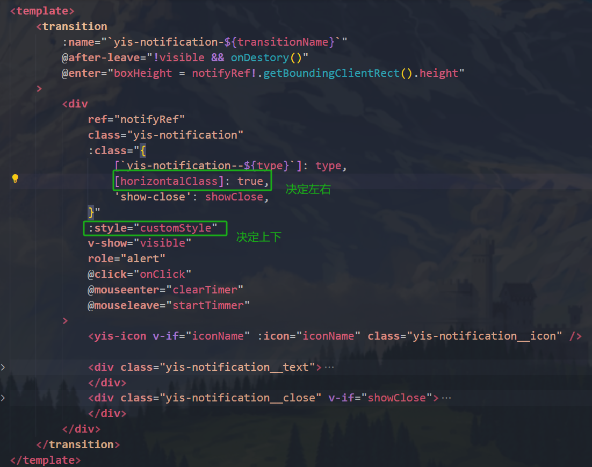


#### Form

##### 实现功能

①基本用法

②对齐方式

③表单校验

④自定义校验规则

##### SFC

①Form.vue

②FormItem.vue

③hooks.vue

##### 单元测试

无单元测试

##### 关键技术细节和难点

①实现表单校验全流程

（1）表单项注册

表单项组件挂载时调用addField，将表单项的上下文注册到fields中

（2）校验触发

调用validate 或 validateField 方法触发校验

（3）筛选字段

使用 filterFields 筛选出需要校验的字段

（4）执行校验

调用doValidateField遍历字段，并调用每个字段的validate方法（这里的validate是FormItem.vue里定义的）

（5）返回结果

如果所有字段校验通过，返回true

如果有字段校验失败，返回包含错误信息的Promise.reject

****

**`核心数据结构`**：

**fields数组**：

```ts
const fields: FormItemContext[] = [];
```

- **作用**：
    - 存储所有注册到表单中的表单项（`FormItem`）的上下文。
    - 每个表单项的上下文包含其 `prop`（字段名）、校验规则、校验状态等信息。
- **来源**：
    - 表单项通过 `addField` 方法注册到 `fields` 中。
    - 表单项被移除时，通过 `removeField` 方法从 `fields` 中移除。

**formCtx**：Form.vue提供的上下文

```ts
const formCtx: FormContext = reactive({
    ...toRefs(props),
    emits,
    addField,
    removeField,
});

// 提供方式
provide<FormContext>(FORM_CTX_KEY, formCtx);
```


**`表单项的注册与移除`**：

**addField方法**

```ts
const addField: FormContext['addField'] = function (field) {
    if (!field.prop) return;
    fields.push(field);
};
```

- **作用**：
    - 将表单项的上下文（`FormItemContext`）添加到 `fields` 数组中。
    - 只有具有 `prop` 属性的表单项才会被注册。
- **调用时机**：
    - 表单项组件（`FormItem`）挂载时调用。


**removeField方法**

```ts
const removeField: FormContext['removeField'] = function (field) {
    if (!field.prop) return;
    fields.splice(fields.indexOf(field), 1);
};
```

- **作用**：
    - 从 `fields` 数组中移除表单项的上下文。
- **调用时机**：
    - 表单项组件（`FormItem`）卸载时调用。


**`表单校验逻辑`**：

**validate方法**

```ts
const validate: FormInstance['validate'] = async function (callback) {
    return validateField([], callback);
};
```

- **作用**：
    - 校验整个表单的所有字段。
    - 内部调用 `validateField` 方法，并传入空的 `keys` 数组，表示校验所有字段。
- **返回值**：
    - 如果校验通过，返回 `true`。
    - 如果校验失败，返回包含错误信息的 `Promise.reject`。


**validateField方法**

```ts
const validateField: FormInstance['validateField'] = async function (keys, callback) {
    try {
        const result = await doValidateField(filterFields(fields, keys));
        if (result === true) {
            callback?.(result);
        }
        return result;
    } catch (error) {
        if (error instanceof Error) throw error;
        const invalidFields = error as ValidateFieldsError;
        callback?.(false, invalidFields);
        return Promise.reject(invalidFields);
    }
};
```

- **作用**：
    - 校验指定的字段（`keys`）。
    - 如果 `keys` 为空，则校验所有字段。
- **核心逻辑**：
    1. 调用 `filterFields` 筛选出需要校验的字段。
    2. 调用 `doValidateField` 执行校验。
    3. 根据校验结果调用回调函数（`callback`）。
- **返回值**：
    - 如果校验通过，返回 `true`。
    - 如果校验失败，返回包含错误信息的 `Promise.reject`。


**doValidateField方法**

```ts
async function doValidateField(fields: FormItemContext[] = []) {
    let validateErrors: ValidateFieldsError = {};
    for (const field of fields) {
        try {
            await field.validate('');
        } catch (error) {
            validateErrors = {
                ...validateErrors,
                ...(error as ValidateFieldsError),
            };
        }
    }
    if (!size(Object.keys(validateErrors))) return true;
    return Promise.reject(validateErrors);
}
```

- **作用**：
    - 执行具体的校验逻辑。
    - 遍历所有需要校验的表单项，调用其 `validate` 方法。
- **核心逻辑**：
    1. 遍历 `fields` 数组中的每个表单项。
    2. 调用表单项的 `validate` 方法进行校验。
    3. 如果校验失败，收集错误信息。
- **返回值**：
    - 如果所有字段校验通过，返回 `true`。
    - 如果有字段校验失败，返回包含错误信息的 `Promise.reject`。


**filterFields方法**

```ts
function filterFields(fields: FormItemContext[], keys: string[] = []) {
    return size(keys) ? filter(fields, field => includes(keys, field.prop)) : fields;
}
```

- 作用
    - 根据 `keys` 筛选出需要校验的字段。
    - 如果 `keys` 为空，则返回所有字段。


**`表单重置与清理`**

**resetFields方法**

```ts
const resetFields: FormInstance['resetFields'] = function (keys) {
    each(filterFields(fields, keys), field => field.resetField());
};
```

- 作用
    - 重置指定字段的值和校验状态。
    - 如果 `keys` 为空，则重置所有字段。


**clearValidate方法**

```ts
const clearValidate: FormInstance['clearValidate'] = function (keys) {
    each(filterFields(fields, keys), field => field.clearValidate());
};
```

- 作用
    - 清除指定字段的校验状态。
    - 如果 `keys` 为空，则清除所有字段的校验状态。


### 其他技术细节

#### 企业级组件库开发全流程


#### ElementPlus的样式相关知识

##### 1. **组件化与原子化设计**

ElementPlus 的样式设计以**组件化**为核心，每个组件的样式独立封装，通过模块化方式组织，避免全局污染。例如，按钮（Button）、输入框（Input）等基础组件的样式均通过原子类（如 `el-button`、`el-input`）实现，开发者可以按需引入，减少冗余代码。
同时，采用 **BEM（Block-Element-Modifier）命名规范**，确保类名语义清晰、结构明确，提升代码可维护性。例如，`.el-button--primary` 表示主要按钮的修饰符样式。

###### 组件化设计

- **定义**：组件化设计是一种将复杂的系统分解为可复用、可维护的组件的过程。它强调将界面中的元素划分为独立的组件，这些组件可以在不同的场景中被重复使用，从而提高开发效率和设计一致性。
- **特点**：
    - **可复用性**：组件可以在多个页面或项目中重复使用，减少重复工作。
    - **可维护性**：组件的独立性使得对单个组件的修改不会影响到其他部分，便于维护和更新。
    - **协作效率**：多人团队可以同时开发不同的组件，提高协作效率。

###### 原子化设计

- **定义**：原子化设计（Atomic Design）是一种由国外网页设计师Brad Frost提出的从化学元素周期表中得到启发的设计方法论。它将界面设计分解为五个层次：原子、分子、组织、模板和页面。
    - **原子（Atoms）**：界面中最基本的元素，如颜色、字体、按钮等。
    - **分子（Molecules）**：由原子组合而成的简单组件。
    - **组织（Organisms）**：由分子组合而成的更复杂的组件。
    - **模板（Templates）**：将组织和分子组合成页面的骨架。
    - **页面（Pages）**：在模板上填充具体数据后形成的最终页面。
- **特点**：
    - **系统性**：从最小的元素开始构建，逐步形成复杂的设计系统。
    - **一致性**：通过统一的原子和分子，确保整个设计系统的一致性。
    - **可扩展性**：可以灵活地添加新的原子、分子和组织，以适应不断变化的需求。

###### 区别

- **概念层次**：原子化设计是一种更底层、更系统的设计理念，它为组件化设计提供了理论基础；而组件化设计更侧重于实际的开发和设计流程。
- **应用范围**：原子化设计适用于从零开始构建设计系统，帮助团队建立统一的设计语言；组件化设计则更适用于具体的项目开发，提高开发效率和代码复用。

##### 2. **主题定制与灵活性**

ElementPlus 提供了**动态主题定制**能力，开发者可以通过以下方式灵活调整样式：

- **CSS 变量覆盖**：通过修改全局 CSS 变量（如 `--el-color-primary`）一键切换主题色，无需深入组件源码。
- **Sass/SCSS 预处理器支持**：内置 Sass 变量文件（如 `theme-chalk/src/common/var.scss`），允许开发者通过修改变量（如颜色、字体、间距等）实现深度定制。
- **按需加载与按需编译**：借助工具（如 `unplugin-element-plus`），仅引入项目中实际使用的组件样式，减少打包体积。


##### 一、设计思想与原则

1. **一致性（Consistency）**
    所有组件的样式遵循统一的设计规范，包括颜色、间距、边框圆角、过渡动画等。例如，按钮的默认圆角设置为`4px`，主色调采用`#409EFF`，并通过类型（primary/success/warning等）扩展出连贯的配色体系，确保视觉统一。
2. **可定制性（Customizability）**
    - **主题定制**：通过CSS变量或SCSS变量覆盖默认样式，支持全局主题切换。例如，ElementPlus允许通过混入（Mixins）或覆盖预定义的SCSS变量（如`$--color-primary`）实现主题定制。
    - **按需配置**：组件支持通过Props动态调整样式，如按钮的`type`、`size`、`plain`等属性，通过类名绑定实现样式的条件渲染。
3. **模块化（Modularity）**
    样式按组件拆分，每个组件的样式文件独立管理，结合CSS预处理器（如Sass）实现嵌套和复用。例如，按钮的样式分为基础样式、类型扩展样式（`.el-button--primary`）和状态样式（`.is-disabled`），避免全局污染811。
4. **响应式与无障碍（Responsive & Accessibility）**
    组件默认适配不同屏幕尺寸，并通过ARIA属性增强无障碍访问。例如，表单组件内置响应式布局，且图标按钮包含`aria-label`描述。


##### 二、样式实现技术细节

1. **CSS架构**
    - **BEM命名规范**：采用Block-Element-Modifier（BEM）规范命名类，如`.el-button__icon`，增强样式可读性和维护性。
    - **分层结构**：样式分为基础层（Base）、布局层（Layout）、组件层（Components）和工具类（Utilities），通过`@layer`指令管理层叠优先级。
2. **动态样式绑定**
    利用Vue的响应式特性，将Props与CSS类名动态关联。例如，按钮组件的类名通过计算属性生成，根据`type`和`size`动态拼接为`el-button--${type}`和`el-button--${size}`。
3. **主题系统实现**
    - **SCSS变量与Mixins**：定义全局变量（如颜色、字体），通过Mixins生成复用样式块。例如，ElementPlus的`@mixin button-variant`用于生成不同状态的按钮样式。
    - **CSS变量覆盖**：支持通过`:root`自定义属性覆盖默认主题，如`--el-color-primary: #1890ff;`。
4. **样式隔离与按需加载**
    使用工具（如Rollup或Vite）将样式文件按组件打包，结合Tree-shaking实现按需加载。例如，通过配置`external`选项排除未使用的依赖，减少最终包体积。


##### 三、工具链与工程化实践

1. **构建工具**
    采用Vite + Rollup组合，支持热更新与高效打包。Rollup配置多入口文件，分别生成ESM和UMD格式，适配不同使用场景。
2. **文档与样式演示**
    - **Vitepress集成**：通过自定义Markdown插件（如`markdown-it-container`）嵌入交互式Demo，结合高亮插件（`prism-theme-vars`）展示代码示例。
    - **Demo组件封装**：将示例代码与组件渲染分离，支持实时预览和源码切换，增强文档的可操作性。
3. **测试与校验**
    - **单元测试**：使用Vitest验证组件样式逻辑，如按钮点击状态下的颜色变化。
    - **样式规范检查**：集成Stylelint和Prettier，强制约定缩进、选择器嵌套等规则。


##### 四、参考案例与扩展方向

1. **仿制组件示例**
    - **按钮组件**：通过Props控制类型、尺寸、图标及禁用状态，结合插槽支持内容自定义。
    - **表单组件**：利用`provide/inject`实现表单项联动，并通过SCSS Mixins统一校验提示样式。
2. **扩展建议**
    - **主题生成工具**：开发可视化主题配置平台，支持实时预览和变量导出。
    - **原子化CSS**：探索Tailwind CSS集成，提升样式开发效率。


#### 依赖注入

在 Vue 3 中，`InjectionKey` 是一个用于确保依赖注入（Dependency Injection）安全性和唯一性的工具。它可以帮助开发者在使用 `provide` 和 `inject` 时避免命名冲突和类型安全问题。

**1. 什么是 `InjectionKey`？**

`InjectionKey` 是一个类型化的键，用于在 Vue 的依赖注入系统中标识和区分不同的提供（provide）和注入（inject）的值。它通常是一个符号（`Symbol`）或一个字符串，但在 TypeScript 中，更推荐使用 `Symbol`，因为它可以提供更好的类型安全性和唯一性。

**2. 为什么需要 `InjectionKey`？**

在 Vue 3 中，`provide` 和 `inject` 是用于跨组件层次传递数据的机制。如果没有 `InjectionKey`，直接使用字符串作为键可能会导致以下问题：

- **命名冲突**：不同的模块或组件可能使用相同的字符串键，导致数据被覆盖。
- **类型安全问题**：在 TypeScript 中，字符串键无法提供类型检查，可能导致运行时错误。

`InjectionKey` 通过使用 `Symbol` 或其他唯一标识符解决了这些问题。

**3. 该项目如何使用该技术？**

ButtonGroup组件中，使用了依赖注入：BUTTON_GROUP_CTX_KEY，来提供size、type、disabled三个属性（都是不同Button的共同属性），在Button.vue中使用inject接收该上下文，然后使用计算属性来计算该3个属性，进行按钮组中对若干个按钮的统一管理。

#### vitest技术栈中it和test的关联

①语义风格

`test` 是 **直接描述测试目标** 的写法，更偏向传统测试风格。

`it` 是 **BDD（行为驱动开发）风格** 的写法，强调用自然语言描述被测代码的预期行为。

②别名关系（同一函数的不同名称）

在 Vitest 源码中，`it` 直接指向 `test` 的实现，二者是同一函数的不同名称：


#### vitest进行单元测试（tsx文件）的一个基本逻辑

①使用到的工具函数

```tsx
import { describe, test, it, expect, vi } from 'vitest';
import { mount } from '@vue/test-utils';
import 其他需要的vue文件或者types.ts
```

②使用describe方法进行分类，可以对SFC分类，或者index.js入口文件测试等等，按君选择

```tsx
// 举一个例子
describe('Button.vue', () => {...});
describe('ButtonGroup.vue', () => {...});
```

③使用it或者test方法进行测试逻辑书写，然后用expect方法进行判断

```tsx
// 举一个例子
describe('Button.vue', () => {
	const onClick = vi.fn();
	test('basic button', async () => {
		const wrapper = mount(() => (
			<Button type="primary" {...{ onClick }}>
				button content
			</Button>
		));
		// class
		expect(wrapper.classes()).toContain('yis-button--primary');
		// slot
		expect(wrapper.get('button').text()).toBe('button content');
		// events
		await wrapper.get('button').trigger('click');
		expect(onClick).toHaveBeenCalledOnce();
	});
```

可以归纳如下：

需要用到模拟函数的（比如点击事件），使用const onClick = vi.fn();

test/it方法传入的参数（‘自己决定写什么’，()=>{}），箭头函数里一般先const wrapper = mount({})，模拟生成一个DOM并顺便配置下该测试DOM需要哪些属性和方法，接着再expect就好了。


#### 工具函数单独封装提高代码复用率

##### utils

###### rAF

###### error.ts

###### debugWarn

作用：手动报错的一种封装实现，具体看下面的三重重载

疑问：为什么需要函数重载而不是直接合并在实现函数中

解答：如果不使用重载，debugWarn只用第三种写法，会出现一些不合法的调用：比如

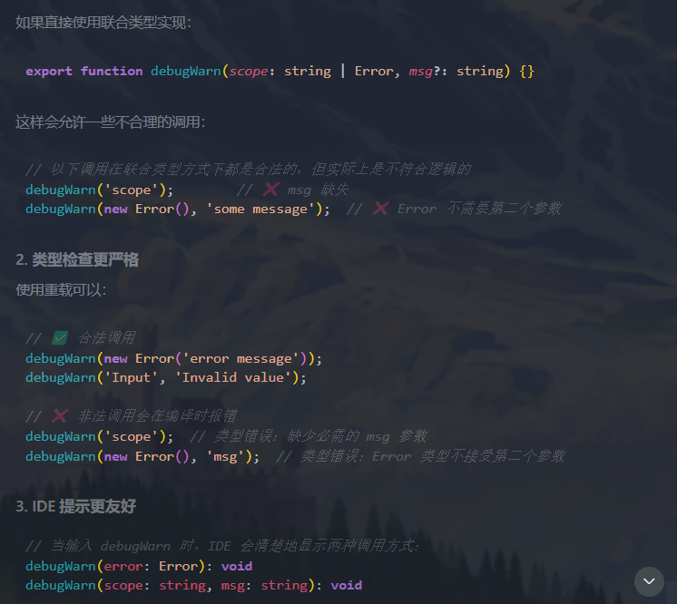

```ts
import { isString } from 'lodash-es';
class YisUIError extends Error {
	constructor(message: string) {
		super(message);
		this.name = 'YisUIError';
	}
}
function createYisUIError(scope: string, msg: string) {
	return new YisUIError(`[${scope}]:${msg}`);
}
export function throwError(scope: string, msg: string) {
	throw createYisUIError(scope, msg);
}
// ts里的函数重载，有3种情况
// 重载1：直接传入 Error 对象
export function debugWarn(error: Error): void;
// 重载2：传入 scope 和 msg
export function debugWarn(scope: string, msg: string): void;
// 重载3：实现函数（这是具体实现，不是真正的重载）
export function debugWarn(scope: string | Error, msg?: string) {
	if (process.env.NODE_ENV !== 'production') {
		const err = isString(scope) ? createYisUIError(scope, msg!) : scope;
		console.warn(err);
	}
}
```

##### hooks

###### useZIndex

###### useEventListener

作用：对target使用addEventListener，在onBeforeUnmount钩子中removeEventListener

```ts
import { onMounted, onBeforeUnmount, watch, isRef, unref, type MaybeRef } from 'vue';

export default function useEventListener(
	target: MaybeRef<EventTarget | HTMLElement | void>,
	event: string,
	handler: (e: Event) => any
) {
	if (isRef(target)) {
		watch(target, (val, oldVal) => {
			oldVal?.removeEventListener(event, handler);
			val?.addEventListener(event, handler);
		});
	} else {
		onMounted(() => target?.addEventListener(event, handler));
	}
	onBeforeUnmount(() => unref(target)?.removeEventListener(event, handler));
}
```

`useFocusController.ts`

作用：管理元素的焦点状态、处理焦点相关事件（focus/blur）、提供焦点状态的生命周期钩子（afterFocus，afterBlur，beforeBlur），最后对外暴露wrapperRef，isFocused，handleFocus，handleBlur

```ts
import { isFunction } from 'lodash-es';
import { getCurrentInstance, ref, type Ref } from 'vue';
import useEventListener from './useEventListener';
interface UseFocusControllerOptions {
	afterFocus?(): void;
	beforeBlur?(event: FocusEvent): boolean | void;
	afterBlur?(): void;
}
export function useFocusController<T extends HTMLElement | { focus(): void }>(
	target: Ref<T | void>,
	{ afterBlur, beforeBlur, afterFocus }: UseFocusControllerOptions = {}
) {
	const instance = getCurrentInstance()!;
	const { emit } = instance;
	const wrapperRef = ref<HTMLElement>();
	const isFocused = ref(false);
	const handleFocus = (event: FocusEvent) => {
		if (isFocused.value) return;
		isFocused.value = true;
		emit('focus', event);
		afterFocus?.();
	};
	const handleBlur = (event: FocusEvent) => {
		// 判断是否需要取消失焦
		const cancelBlur = isFunction(beforeBlur) ? beforeBlur(event) : false;
		// 检查相关目标是否在包装器内
		if (
			cancelBlur ||
			(event.relatedTarget && wrapperRef.value?.contains(event.relatedTarget as Node))
		)
			return;
		isFocused.value = false;
		emit('blur', event);
		afterBlur?.();
	};
	const handleClick = () => {
		target.value?.focus();
	};
	useEventListener(wrapperRef, 'click', handleClick);
	return {
		wrapperRef,
		isFocused,
		handleFocus,
		handleBlur,
	};
}
export default useFocusController;
```

###### useProp

作用：传入一个propName参数，获取当前的实例对象，然后返回该实例的propName对应value

```ts
import { computed, getCurrentInstance, type ComputedRef } from 'vue';
export default function useProp<T>(propName: string): ComputedRef<T> {
	const instance = getCurrentInstance();
	if (!instance) {
		throw new Error('useProp must be called within a component');
	}
	return computed(() => (instance?.proxy?.$props as any)?.[propName] as T);
}
```

###### useId

作用：动态生成随机的id，并带有一定格式，不过有非常小的几率会出现不同组件间的prefix一样。可以用时间戳Date.now()来改进

```ts
import { type Ref, computed } from 'vue';
const defaultIdInjection = {
	prefix: Math.floor(Math.random() * 10000),
	current: 0,
};
export function useId(namespace: string = 'yis'): Ref<string> {
	const idRef = computed(
		() => `${namespace}-id-${defaultIdInjection.prefix}-${defaultIdInjection.current++}`
	);

	return idRef;
}
export default useId;
```


#### 条件编译

项目根目录下创建env.d.ts，可以在SFC逻辑中控制是什么环境下，才可以调用什么函数

```ts
declare const PROD: boolean;
declare const DEV: boolean;
declare const TEST: boolean;
```

另外，在根目录的package.json的scripts部分，也可以可以加上cross-env NODE_ENV=环境类型，来进行对应的环境的调试


#### VNode虚拟DOM相关知识

在 Vue 3 中，`VNode`（虚拟节点）是 Vue 的核心概念之一，用于表示 DOM 的虚拟版本。它是 Vue 实现高效 DOM 操作和响应式更新的关键数据结构。`VNode` 的作用主要体现在以下几个方面：

##### **1. 提高性能**

`VNode` 是对实际 DOM 的轻量级表示。Vue 通过比较新旧 `VNode` 的差异（即虚拟 DOM 的 diff 算法），来确定需要对实际 DOM 进行哪些最小化的更新。这种机制避免了直接操作 DOM 的高成本，从而提高了性能。

##### **2. 实现响应式更新**

当 Vue 的响应式数据发生变化时，Vue 会重新渲染组件并生成新的 `VNode`。通过比较新旧 `VNode`，Vue 可以高效地更新实际 DOM，确保界面与数据保持同步。

##### **3. 支持服务器端渲染（SSR）**

`VNode` 的存在使得 Vue 能够在服务器端渲染组件，生成 HTML 字符串，然后将其发送到客户端。客户端接收到 HTML 字符串后，Vue 可以将其与对应的 `VNode` 关联起来，从而实现无缝的客户端交互。

##### **4. 提供统一的渲染接口**

`VNode` 提供了一个统一的渲染接口，使得 Vue 可以在不同的渲染器（如浏览器 DOM 渲染器、服务器端渲染器等）之间共享相同的逻辑。这种设计使得 Vue 的核心逻辑与渲染逻辑解耦，提高了代码的可维护性和可扩展性。

##### **5. 支持自定义渲染器**

Vue 3 引入了可组合的渲染器 API，允许开发者创建自定义的渲染器。`VNode` 作为渲染器的核心数据结构，使得这种自定义成为可能。例如，你可以创建一个用于渲染到 Canvas 或 WebGL 上的自定义渲染器。

##### **6. 支持 Fragment 和 Portal**

`VNode` 的设计使得 Vue 能够支持更复杂的渲染场景，如 Fragment（片段）和 Portal（跨组件渲染）。Fragment 允许组件返回多个根节点，而 Portal 则允许组件将内容渲染到父组件之外的 DOM 中。

##### **7. 提供详细的渲染上下文**

`VNode` 包含了丰富的信息，如组件的实例、渲染上下文、子节点等。这使得 Vue 可以在渲染过程中进行详细的控制和优化。

##### **VNode 的结构**

一个 `VNode` 对象通常包含以下属性：

- **`type`**：表示节点的类型（如字符串、组件、Fragment 等）。
- **`props`**：节点的属性。
- **`children`**：子节点数组。
- **`el`**：对应的实际 DOM 元素。
- **`key`**：用于标识节点的唯一键。
- **`component`**：如果节点是一个组件，这里会包含组件的实例。

##### **示例：VNode 的创建和更新**

```js
import { createVNode, render } from 'vue';

// 创建一个 VNode
const vnode = createVNode('div', { id: 'container' }, 'Hello, Vue!');

// 将 VNode 渲染到 DOM 中
const container = document.getElementById('app');
render(vnode, container);

// 更新 VNode
vnode.children = 'Updated content!';
render(vnode, container);
```


#### 着重关注两个打包方式文件

vite.es.config.ts和vite.umd.config.ts


